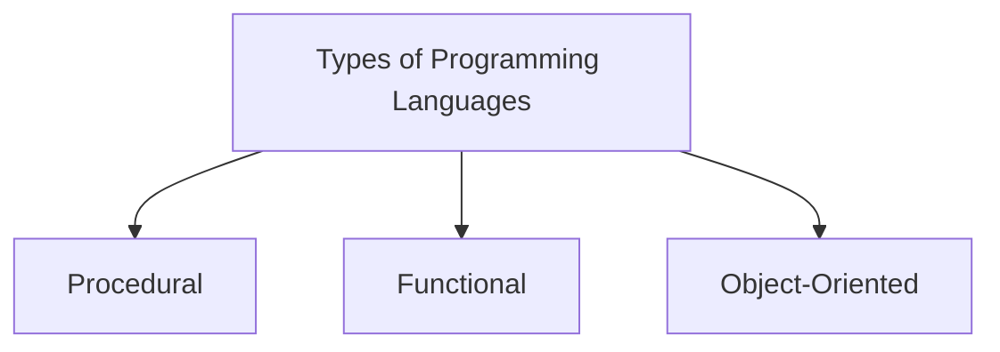

# 1 · Introduction to Programming

> 📁 Part 1 of 3 in [Ytube dsa/](README.md) · **Next:** [02 — Flow of the Program](02-Flow_Of_Program_Notes.md)

## Introduction
**Programming is instructing a computer to perform a task.** The catch is that a CPU understands only **binary** — 0s and 1s. Writing instructions directly in binary is unbearable for humans, so we invented **programming languages**: human-readable notation that a translator (compiler or interpreter) turns into binary for us.

That is the entire reason languages exist. Everything else — syntax, types, paradigms — is about making that translation *safe* and *pleasant*.

## Characteristics of a Programming Language
- **Human-readable:** written in words and symbols people can reason about, not machine opcodes.
- **Translatable:** a compiler and/or interpreter converts it into machine code the CPU can run.
- **Rule-bound (syntax):** each language has a fixed grammar; break it and translation fails.
- **Paradigm-flavoured:** each language nudges you toward a style — procedural, functional, or object-oriented.
- **Typed (loosely or strictly):** how seriously it checks that a value matches its intended kind, and *when* it checks.

## Important Note
The word "language" is doing real work here. A programming language is not just shorthand for binary — it is a **contract about what the machine will check for you**. Java checks a great deal before your program ever runs; JavaScript checks almost nothing until the line executes. That single difference explains most of what feels alien when moving from JS to Java.

## 1. The Three Paradigms
A **paradigm** is a style of organising a program. Most real languages support more than one — the label describes the *default habit*, not a cage.



- **Procedural** — a program is a series of well-structured steps and procedures. A systematic order of statements, functions, and commands that complete a task. *(C, and the way you write a `main` method.)*
- **Functional** — a program is built only from **pure functions**: never modify a variable, only produce a new value as output. Suits work where many different operations run over the same data set — data processing, ML pipelines. *(Haskell; JS `map`/`filter`/`reduce`.)*
- **Object-Oriented** — a program revolves around **objects**, where **code + data = object**. Designed to make software easier to develop, debug, reuse, and maintain. *(Java classes, JS classes.)*

> 💡 **One language can be all three.** Python is the classic example. **Java is procedural *and* object-oriented** — and since Java 8 (lambdas + streams) it has real functional tools too, so in practice modern Java is a three-paradigm language.

## 2. Static vs Dynamic Languages
The single biggest jump from JavaScript to Java. It is about **when** the language checks that a value matches its type.

| | **Static** (Java) | **Dynamic** (JavaScript) |
|---|---|---|
| Type checking happens | at **compile time** | at **runtime** |
| Errors surface | before the program ever runs | possibly not until that line executes in production |
| Datatypes | must be **declared** before use | no declaration needed |
| Trade-off | more control, more safety | faster to write, but can blow up at runtime |

In this example, we try to put a `String` into an `int` in both languages and watch *when* each one complains.

```java
public class TypeDemo {
    public static void main(String[] args) {
        int x = 5;
        // x = "hello";   // <- uncomment: the program will NOT compile
        System.out.println(x);
    }
}
```
**Output: static typing**
```
5
```
If you uncomment that line, you never reach the output at all — `javac` stops you:
```
error: incompatible types: String cannot be converted to int
```

```javascript
// JavaScript — the same idea is simply allowed
let x = 5;
x = "hello";      // no complaint at all
console.log(x);   // hello
```

> 💡 **`var` in Java is still static typing.** `var x = 5;` (Java 10+) does not mean "any type" like JS `var` — the compiler *infers* `int` at compile time and locks it in. `x = "hello";` after that is still a compile error.

## 3. Memory Management — Stack & Heap
Java splits memory into two regions:

- **Stack** — holds each method call's frame: its **local variables**, and for objects the **reference** (the address) pointing into the heap. Fast, automatically cleaned up when the method returns.
- **Heap** — holds **objects** (anything created with `new`, arrays, strings). Shared, longer-lived, cleaned up by the garbage collector.

> ⚠️ **Correction to the lecture notes.** The PDF illustrates this with `a = 10`, calling `a` a "reference variable" and `10` its "object on the heap". That is **not true in Java for primitives.** For `int a = 10;`, the value `10` sits *directly* in the stack frame — there is no heap object and no reference. The stack-points-to-heap picture is correct only for **objects**: `int[] arr = {1,2,3}` or `String s = new String("hi")`. Remember the accurate version — this exact distinction is what [[References vs Values]] (item 0.6) is built on, and it is a common interview probe.

In this example, we copy a primitive and then copy a reference, and see that only one of them shares state.

```java
public class MemoryDemo {
    public static void main(String[] args) {
        // PRIMITIVE — the value itself lives on the stack, so this is a real copy
        int a = 10;
        int b = a;
        b = 20;
        System.out.println("a = " + a + ", b = " + b);

        // OBJECT — the array lives on the heap; x and y are two references to the SAME array
        int[] x = {1, 2, 3};
        int[] y = x;
        y[0] = 99;
        System.out.println("x[0] = " + x[0] + ", y[0] = " + y[0]);
    }
}
```
**Output: stack vs heap**
```
a = 10, b = 20
x[0] = 99, y[0] = 99
```

## 4. Points to Remember (references & garbage collection)
- **More than one reference variable can point to the same object.** `y = x` copies the *address*, not the contents.
- **A change through any reference is visible through all of them** — because there is only one object.
- **An object with no reference pointing at it is destroyed by Garbage Collection.** You never call `free()` in Java; the JVM reclaims unreachable objects automatically.

```java
int[] data = {1, 2, 3};
data = new int[]{9, 9};   // the {1,2,3} array now has ZERO references -> eligible for GC
```

## ⚠️ Common Misunderstandings
**1. "`int a = 10` puts an object on the heap."**
❌ primitives live on the heap with a reference on the stack · ✅ a local primitive's **value sits in the stack frame**; only objects/arrays live on the heap.
*Why:* the lecture notes over-generalise the reference→object picture. It holds for objects, not primitives. See [[References vs Values]].

**2. Confusing static typing with "having to write the type everywhere".**
❌ `var x = 5;` means Java is dynamic now · ✅ `var` is **compile-time inference**; the type is still fixed and still checked before running.
*Why:* static vs dynamic is about *when checking happens*, not about how much you type.

**3. "Copying a variable always makes an independent copy."**
❌ `int[] y = x;` gives you a second array · ✅ it gives you a second **reference to the same array** — mutating through either is visible through both.
*Why:* the assignment copies the address, not the contents. Same trap exists in JS, but Java's `int` vs `int[]` split makes it sharper.

**4. "Java is an object-oriented language, full stop."**
❌ purely OOP · ✅ Java is **procedural *and* object-oriented**, with functional tools since Java 8.
*Why:* paradigms describe habits, not exclusive categories — one language can be all three (Python).

**5. "Garbage collection means I never think about memory."**
❌ memory is free and infinite · ✅ GC removes *unreachable* objects only — a reference you forget to drop keeps its object alive forever.
*Why:* reachability, not usefulness, is the rule. This is how memory leaks still happen in a GC language.

## JavaScript Comparison
| | Java | JavaScript |
|---|---|---|
| Type checking | **Static** — at compile time | **Dynamic** — at runtime |
| Declaring a variable | `int x = 5;` (type required) | `let x = 5;` (no type) |
| `x = "hello"` after `x = 5` | compile error | perfectly legal |
| Type inference | `var x = 5;` — inferred but **fixed** | `let x = 5;` — inferred and **changeable** |
| Primitives | true primitives (`int`, `char`) copied by value | primitives copied by value too (`number`, `string`) |
| Objects | reference on stack → object on heap | reference → object on heap (same idea) |
| Memory cleanup | Garbage Collection | Garbage Collection |
| Paradigms | procedural + OOP (+ functional since Java 8) | all three |

## Interview Angles
- **"Stack vs heap?"** — Locals and references on the stack (per method call, auto-freed on return); objects on the heap (shared, GC-managed). Be precise that **primitives are not heap-allocated** — that precision is what separates a memorised answer from an understood one.
- **"Static vs dynamic typing — which is better?"** — Not a trick question: name the trade-off. Static catches whole classes of bugs before shipping; dynamic is faster to write and more flexible. Cite your own JS → Java experience.
- **"What is garbage collection?"** — Automatic reclamation of heap objects that are no longer **reachable** from any reference. Mention that unreachable ≠ unused: a lingering reference prevents collection.
- **"Is Java pass-by-value or pass-by-reference?"** — The classic follow-up to the memory question. Java is **always pass-by-value** — but for objects, the *value being copied is the reference*. That is why a method can mutate your array but cannot reassign your variable.

## Related · Next
- **Related:** [[Variables and Types]] (0.2 — static typing in daily use) · [[References vs Values]] (0.6 — the full stack/heap model)
- **Next:** [02 — Flow of the Program](02-Flow_Of_Program_Notes.md)

---

## 🔁 Rapid Revision (self-test)
Answer out loud **before** expanding.

<details><summary>1. Why do programming languages exist at all?</summary>

Computers understand only binary (0s and 1s). Writing instructions in binary is impractical for humans, so we write in a human-readable language and let a compiler/interpreter translate it.
</details>

<details><summary>2. Name the three paradigms and Java's place among them.</summary>

Procedural (ordered steps/procedures), Functional (pure functions, never mutate — new value out), Object-Oriented (code + data = objects). Java is procedural **and** object-oriented (plus functional tools since Java 8). One language can be all three — e.g. Python.
</details>

<details><summary>3. Static vs dynamic — give the four differences.</summary>

Type checking at compile time vs runtime · errors before running vs possibly at runtime · datatypes declared vs not declared · more control vs faster to write but riskier.
</details>

<details><summary>4. Where does `int a = 10;` live? Where does `int[] x = {1,2,3};` live?</summary>

`a`'s value 10 lives directly in the **stack** frame (no heap object). For `x`, the **reference** is on the stack and the **array object** is on the heap.
</details>

<details><summary>5. `int[] y = x; y[0] = 99;` — what is `x[0]` now, and why?</summary>

`99`. The assignment copied the **reference**, not the array, so `x` and `y` point at one single object on the heap. A change through either is visible through both.
</details>

<details><summary>6. What happens to an object with no references?</summary>

It becomes unreachable and is destroyed by **Garbage Collection**. You never free memory manually.
</details>
