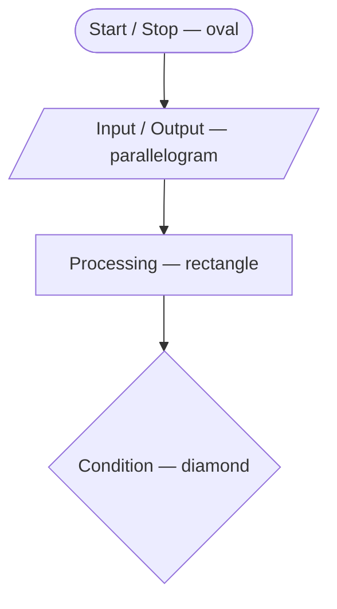
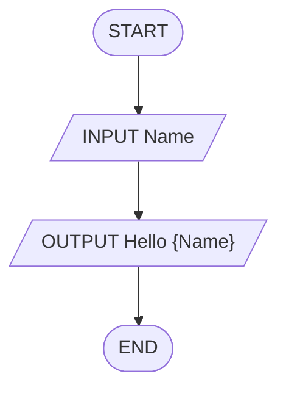
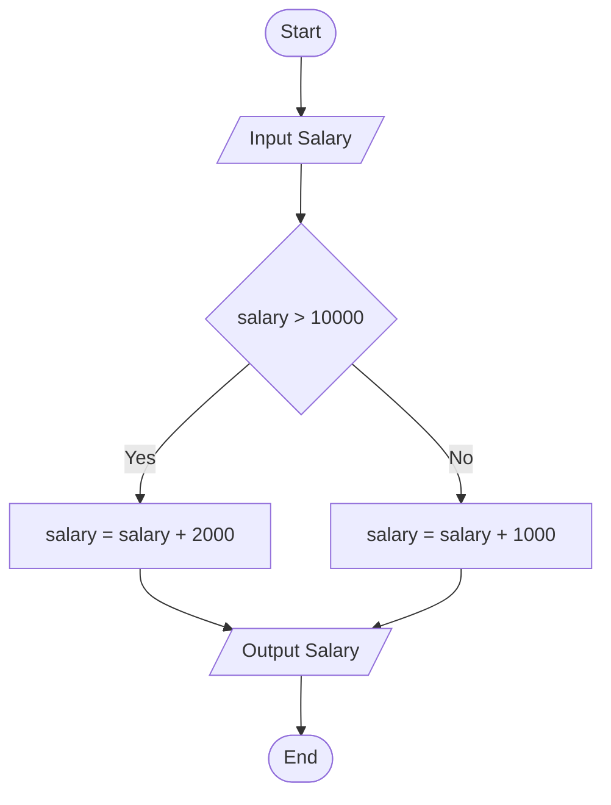
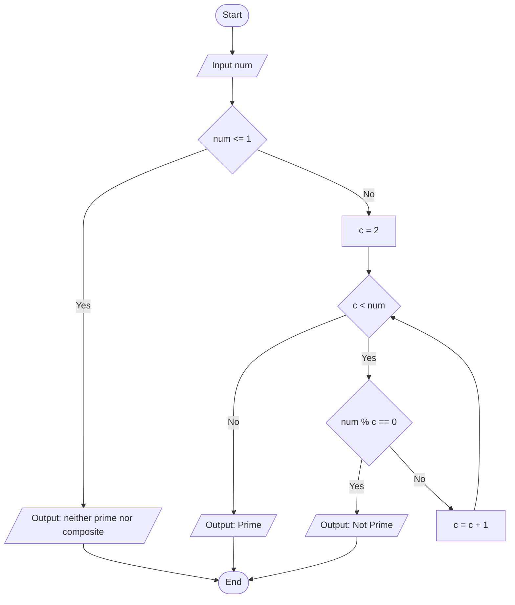

# 2 · Flow of the Program

> 📁 Part 2 of 28 in [Ytube dsa/](README.md) · **Prev:** [01 — Introduction to Programming](01-Intro_to_Programming_Notes.md) · **Next:** [03 — How Java Works](03-Introduction_to_Java_Notes.md)

## Introduction
Before you write code, you plan the **flow**: the order of steps, the decisions, the loops. Two tools do this — a **flowchart** (a picture) and **pseudocode** (rough, syntax-free code). Neither runs. Both exist so that the *thinking* is finished before the *typing* starts.

This is the habit that carries into every DSA problem: **brute force in words → flow → pseudocode → Java**. Skipping it is why people freeze on a whiteboard.

## Characteristics of a Flowchart
- **Visual:** a diagram of your thought process / algorithm.
- **Symbol-driven:** each shape has one fixed meaning (below) — no free-styling.
- **Directional:** arrows show the exact order of execution.
- **Language-agnostic:** the same chart translates to Java, JS, or Python.

## Why Bother Drawing / Writing This?
- **Separates thinking from syntax:** you solve the problem once, then translate — instead of debugging logic and semicolons at the same time.
- **Exposes missing branches:** an unhandled case is *visible* as a dangling arrow long before it becomes a wrong answer.
- **It is the interview format:** you talk through the approach before writing code. Pseudocode is that conversation, written down.
- **Pseudocode has no syntax rules** — it only has to be unambiguous. That is the point: nothing can go wrong except the logic, which is exactly what you want to test.

## 1. The Five Flowchart Symbols
| Symbol | Shape | Meaning |
|---|---|---|
| **Start / Stop** | Oval | The entry and exit points of the chart. |
| **Input / Output** | Parallelogram | Reading input or printing output. |
| **Processing** | Rectangle | A computation or variable assignment. |
| **Condition** | Diamond | A test that yields true/false (Yes/No). |
| **Flow direction** | Arrow | The order the program moves in. |



## 2. Example 1 — Take a name, output "Hello name"
The simplest possible flow: input → output. No decisions, no loops.



```java
import java.util.Scanner;

public class HelloName {
    public static void main(String[] args) {
        Scanner sc = new Scanner(System.in);
        System.out.print("Enter name: ");
        String name = sc.nextLine();
        System.out.println("Hello " + name);
    }
}
```
**Output: Example 1** *(typing `Thowfik` at the prompt)*
```
Enter name: Thowfik
Hello Thowfik
```

## 3. Example 2 — Salary bonus (a condition)
Take a salary. If it is greater than 10,000 add a bonus of 2000, otherwise add 1000. This introduces the **diamond**: two branches that *rejoin* before the output.



**Pseudocode**
```text
Start
Input Salary
if Salary > 10000 :
    Salary = Salary + 2000
else :
    Salary = Salary + 1000
Output Salary
exit
```

```java
public class SalaryBonus {
    public static void main(String[] args) {
        int salary = 12000;

        if (salary > 10000) {
            salary = salary + 2000;
        } else {
            salary = salary + 1000;
        }

        System.out.println("Final salary: " + salary);
    }
}
```
**Output: Example 2**
```
Final salary: 14000
```
> 💡 Notice both branches converge on **one** output box. A common beginner flowchart bug is printing separately in each branch — it works, but it duplicates logic and hides the fact that only the *value* differed.

## 4. Example 3 — Prime or not (a loop + a condition)
Input a number, print whether it is prime. This is the first flow with a **loop**: the "no" branch of the inner test walks back up to the counter.



**Pseudocode**
```text
Start
Input num
if num <= 1 :
    Output "Neither prime nor composite"
    Exit
c = 2
while c < num :
    if num % c == 0 :
        Output "Not Prime"
        Exit
    c = c + 1
end while
Output "Prime"
Exit
```

> ⚠️ **Correction to the lecture notes.** The PDF's pseudocode prints *"neither prime nor composite"* for `num <= 1` but never **exits** — so it falls straight into the loop and prints a second, contradictory answer. Always terminate a guard clause. The version above adds the missing `Exit`.

```java
public class PrimeCheck {
    public static void main(String[] args) {
        int num = 17;

        if (num <= 1) {
            System.out.println(num + " is neither prime nor composite");
            return;                       // <- the guard clause MUST stop here
        }

        boolean isPrime = true;
        int c = 2;
        while (c < num) {
            if (num % c == 0) {
                isPrime = false;
                break;                    // one divisor is enough — stop looking
            }
            c++;
        }

        System.out.println(num + " is " + (isPrime ? "Prime" : "Not Prime"));
    }
}
```
**Output: Example 3**
```
17 is Prime
```

## 5. Optimizing the Prime Check — why √n is enough
Look at every factor pair of **36**:

| Pair | Product | Group |
|---|---|---|
| 1 × 36 | 36 | (i) |
| 2 × 18 | 36 | (i) |
| 3 × 12 | 36 | (i) |
| 4 × 9 | 36 | (i) |
| **6 × 6** | **36** | ← the mirror point = **√36** |
| 9 × 4 | 36 | (ii) |
| 12 × 3 | 36 | (ii) |
| 18 × 2 | 36 | (ii) |
| 36 × 1 | 36 | (ii) |

Group (ii) is group (i) written backwards. Every factor above √n is just the partner of a factor below √n — so **if no divisor exists below √n, none exists above it either.** Checking `2 … √num` is therefore **complete**, not a risky shortcut.

The saving is enormous:

| Number | Naive loop (`c < num`) | Optimized (`c*c <= num`) |
|---|---|---|
| 17 | up to 16 checks | up to **4** |
| 23,456,786,543 | ~23 **billion** checks | ~**153,156** |

**Optimized pseudocode**
```text
start
input n
if n <= 1 :
    print "neither prime nor composite"
    exit
c = 2
while c*c <= n :
    if n % c == 0 :
        output "not prime"
        exit
    c += 1
end while
output "prime"
exit
```

```java
public class PrimeOptimized {
    public static void main(String[] args) {
        System.out.println(check(1));
        System.out.println(check(17));
        System.out.println(check(36));
    }

    static String check(int n) {
        if (n <= 1) {
            return n + " -> neither prime nor composite";
        }
        // c * c <= n  is the same test as  c <= sqrt(n), but with no floating-point rounding
        for (int c = 2; c * c <= n; c++) {
            if (n % c == 0) {
                return n + " -> not prime (divisible by " + c + ")";
            }
        }
        return n + " -> prime";
    }
}
```
**Output: optimized prime check**
```
1 -> neither prime nor composite
17 -> prime
36 -> not prime (divisible by 2)
```
> 💡 Prefer `c * c <= n` over `c <= Math.sqrt(n)`: it stays in integer arithmetic (no floating-point rounding at the boundary) and avoids recomputing a `sqrt` every iteration. For very large `n`, guard the multiplication against overflow with `(long) c * c <= n`.

## Complexity Cheat-Sheet
| Version | Loop bound | Cost | Why |
|---|---|---|---|
| Naive | `c < num` | **O(n)** | tests every number below `num` |
| Optimized | `c * c <= num` | **O(√n)** | factors mirror around √n, so half the pairs are duplicates |

This is your first real taste of [[Big-O Intuition]] (item 1.1) — **same answer, dramatically less work**. That is what "optimization" means in DSA: not a faster machine, a smaller amount of work.

## ⚠️ Common Misunderstandings
**1. A guard clause that prints but doesn't exit.**
❌ `if (n <= 1) { print("neither"); }` then falling into the loop · ✅ `return;` / `Exit` immediately after the message.
*Why:* the lecture's Example-3 pseudocode has this bug — it would print two contradictory answers for `n = 1`.

**2. Looping all the way to `num` when checking primality.**
❌ `while (c < num)` — O(n) · ✅ `while (c * c <= num)` — O(√n), and provably just as correct.
*Why:* factors come in mirrored pairs around √n; everything above √n is a duplicate of something below it.

**3. Using `c <= Math.sqrt(n)` as the loop bound.**
❌ recomputes a `double` square root each iteration and can round at the boundary · ✅ `c * c <= n` (or `(long) c * c <= n` for large `n`).
*Why:* integer arithmetic is exact; floating point is not.

**4. Forgetting that 0, 1 and negatives are neither prime nor composite.**
❌ starting the loop at `c = 2` with no guard · ✅ handle `n <= 1` first.
*Why:* with `n = 1` the loop body never runs, so the code falls through and happily reports "Prime".

**5. Not stopping at the first divisor.**
❌ letting the loop run to the end after already finding a factor · ✅ `break` (or `return`) the moment `num % c == 0`.
*Why:* one divisor is proof. Continuing is pure wasted work — and in an interview it reads as not thinking about cost.

**6. Treating the flowchart as busywork.**
❌ jumping straight to Java on a problem you haven't solved in your head · ✅ words → flow → pseudocode → code.
*Why:* debugging logic and syntax simultaneously is what makes people freeze. Separate the two.

## Interview Angles
- **"How would you check if a number is prime?"** — Always volunteer both: naive **O(n)**, then **O(√n)** *with the factor-pair reason*, not just the formula. Interviewers score the justification, not the trick.
- **"Can you optimize it further?"** — Yes: after checking 2, only test odd divisors (halves the work, still O(√n)); for *many* queries, switch to a **Sieve of Eratosthenes** (item 5.10). Knowing when to change algorithm rather than tune a loop is the real signal.
- **"Walk me through your approach before you code."** — This is literally the pseudocode step. Practise saying the flow out loud; it is a graded part of every interview.
- **Edge cases they probe:** `n = 0`, `n = 1`, `n = 2` (the only even prime), and negatives. Name them unprompted.

## Related · Next
- **Related:** [[Conditionals]] (0.3) · [[Loops]] (0.4) · [[Big-O Intuition]] (1.1 — where O(n) → O(√n) leads)
- **Practice:** re-draw the Example-3 flowchart from memory, then hand-write `PrimeOptimized.java` without looking. Then add a method that prints every prime below 100 using the √n check.
- **Next:** [03 — How Java Works](03-Introduction_to_Java_Notes.md)

---

## 🔁 Rapid Revision (self-test)
Answer out loud **before** expanding.

<details><summary>1. What are the five flowchart symbols?</summary>

Oval = Start/Stop · Parallelogram = Input/Output · Rectangle = Processing · Diamond = Condition · Arrow = Flow direction.
</details>

<details><summary>2. What is pseudocode, and what rule does it follow?</summary>

Rough code representing how an algorithm works. It has **no syntax requirements** — it only has to be unambiguous. That is deliberate: nothing can be wrong except the logic.
</details>

<details><summary>3. In the salary example, why do both branches point at one output box?</summary>

Only the *value* differs between branches, not the action. Converging on a single output keeps the logic in one place instead of duplicating the print in both branches.
</details>

<details><summary>4. What's the bug in the lecture's Example-3 pseudocode?</summary>

The `num <= 1` guard prints "neither prime nor composite" but never **exits**, so execution falls into the loop and prints a second, contradictory answer. A guard clause must terminate.
</details>

<details><summary>5. Why is checking divisors only up to √n correct (not just faster)?</summary>

Factors come in pairs that mirror around √n (for 36: 1×36 … 6×6 … 36×1). Every factor above √n is the partner of one below it, so if nothing below √n divides n, nothing above it does either.
</details>

<details><summary>6. Naive vs optimized prime check — complexity?</summary>

O(n) vs **O(√n)**. For 23,456,786,543 that is ~23 billion checks vs ~153,156.
</details>

<details><summary>7. Why write `c * c <= n` instead of `c <= Math.sqrt(n)`?</summary>

It stays in exact integer arithmetic (no floating-point rounding at the boundary) and avoids recomputing a square root every iteration. For very large `n`, use `(long) c * c <= n` to avoid overflow.
</details>
