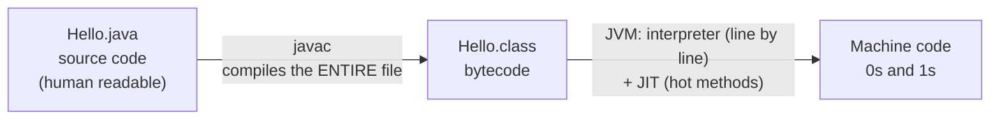
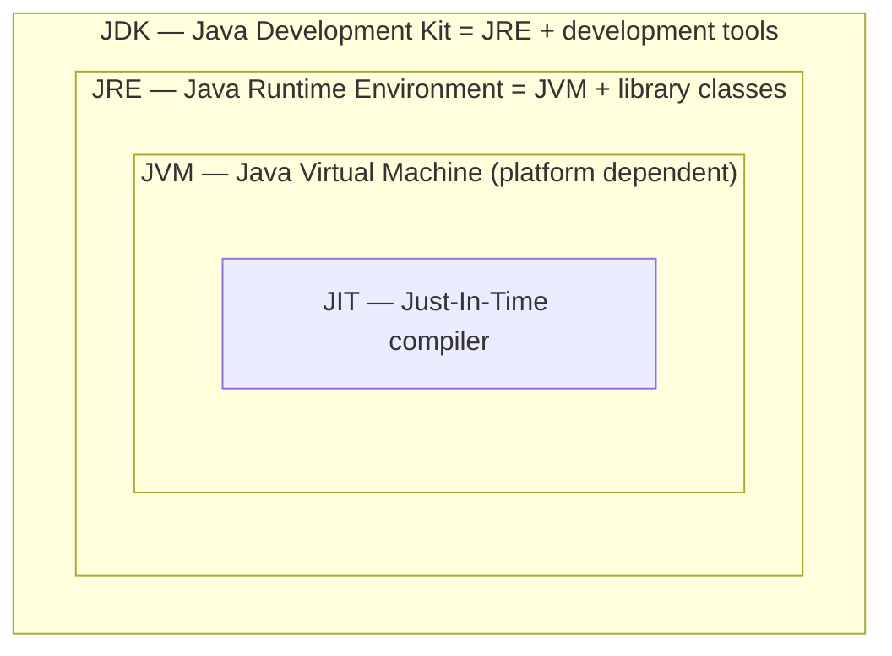
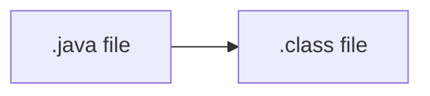
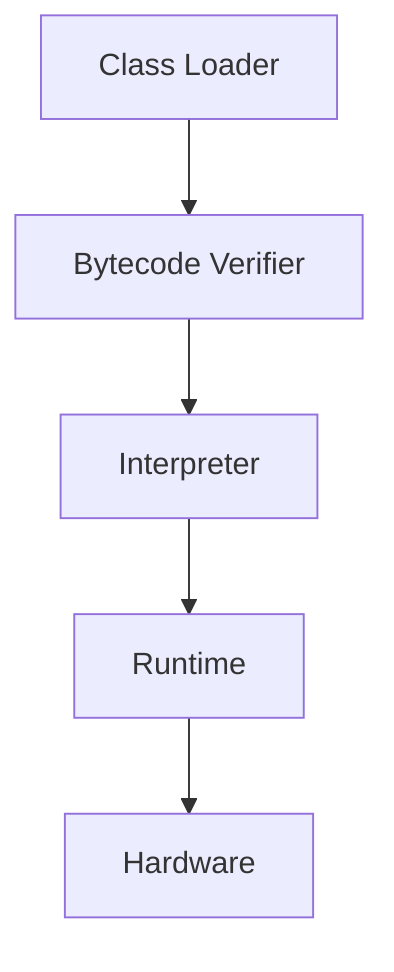
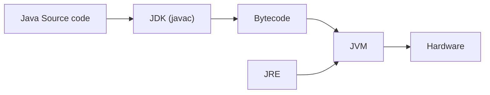

# 3 · How Java Actually Works

> 📁 Part 3 of 7 in [Ytube dsa/](README.md) · **Prev:** [02 — Flow of the Program](02-Flow_Of_Program_Notes.md) · **Next:** [04 — Your First Java Program](04-First_Java_Program_Notes.md)

## Introduction
You write `.java`, you run `java`, output appears. In between sits the machinery that makes Java **platform independent** — and it is the single most-asked "explain Java" interview question. Three artifacts matter: **source code**, **bytecode**, **machine code**.

## Characteristics of the Java Execution Model
- **Two-stage translation:** compiled to bytecode *ahead* of time, then translated to machine code *at* runtime.
- **Portable output:** the artifact you ship (`.class` bytecode) is not tied to any operating system.
- **Runtime-managed:** loading, verification, memory, and cleanup are the JVM's job, not yours.
- **Adaptive:** the JVM starts by interpreting, then compiles the hot paths — so the same program gets faster as it runs.

## Important Note
The whole design exists to move the platform-specific step **out of your build and into the runtime**. C/C++ decides "which machine?" when *you* compile. Java defers that decision until the program actually starts, on whatever machine it lands on. Everything below is a consequence of that one choice.

## 1. The Pipeline: source → bytecode → machine code

- **Source code** — what you write, saved as **`.java`**. Human readable.
- **Java compiler (`javac`)** — converts source into **bytecode**, saved as **`.class`**. It compiles the **whole file at once**. Bytecode **cannot run directly on the OS** — you need a JVM. *This indirection is exactly why Java is platform independent.*
- **Java interpreter (inside the JVM)** — converts bytecode into machine code (0s and 1s), translating **line by line**.

## 2. Why "platform independent" (and why the JVM is not)
- Bytecode can run on **any** operating system that has a JVM.
- A computer only understands machine code, so something must translate.
- In **C/C++**, compiling produces an **`.exe`** — machine code for *that one platform*. Move it to another OS and it will not run: **platform dependent**.
- In **Java**, compiling produces **bytecode**; the local JVM converts it to machine code at runtime.
- Therefore: **Java is platform independent, but the JVM is platform dependent.** You download a *different* JVM for Windows, macOS, and Linux — and that is precisely what lets your one `.class` file run everywhere. (This is "**WORA** — Write Once, Run Anywhere".)

## 3. Architecture — JDK ⊃ JRE ⊃ JVM ⊃ JIT

**JDK** — provides the environment to **develop *and* run** Java. It is a package that includes:
1. **Development tools** — the environment to build and run your program
2. **JRE** — to execute your program
3. **A compiler** — `javac`
4. **An archiver** — `jar`
5. **A docs generator** — `javadoc`
6. **An interpreter / loader** — `java`

**JRE** — an installation package that provides the environment to **only run** a program. It consists of:
1. Deployment technology
2. User interface toolkit
3. Integration libraries
4. Base libraries
5. **JVM** — Java Virtual Machine

> 💡 **Modern note:** since Java 11, Oracle no longer ships a standalone JRE — you install the **JDK** (which contains it) and, if you need a slim runtime for shipping, you build one with `jlink`. The JDK ⊃ JRE ⊃ JVM *model* is still exactly right and still what interviewers ask for.

## 4. Compile time vs Runtime
**Compile time** is one step: `javac` turns `.java` into `.class`.

**Runtime** — once the `.class` exists, the JVM runs this chain:

1. The **class loader** loads all classes needed to execute the program.
2. The JVM sends the code to the **bytecode verifier** to check the format/safety of the code.
3. The **interpreter** (helped by the JIT) executes it against the hardware.

## 5. How the Class Loader Works — Loading → Linking → Initialization
- **Loading**
  - Reads the `.class` file and generates binary data.
  - A `Class` object representing this type is created **in the heap**. *(Note: this is a `java.lang.Class` object describing your class — not an instance of your class.)*
- **Linking**
  - **Verify:** the JVM verifies the `.class` file is well-formed and safe.
  - **Prepare:** allocates memory for class (static) variables and assigns **default values** (`0`, `false`, `null`).
  - **Resolve:** replaces symbolic references in the type with direct references.
- **Initialization**
  - All static variables are assigned the values written in your code, and `static { }` blocks run.
  - The JVM holds the **stack** and **heap** memory areas used from here on (see [01 — Introduction to Programming](01-Intro_to_Programming_Notes.md)).

> 💡 The Prepare-then-Initialize split is why a `static int count;` is `0` *before* your assignment runs — Java gives every field a default before your code touches it. Same defaults rule you meet in [[Variables and Types]].

## 6. JVM Execution — Interpreter vs JIT
- **Interpreter**
  - Line-by-line execution.
  - Weakness: when one method is called many times, it gets interpreted **again and again** — repeated work.
- **JIT (Just-In-Time compiler)**
  - Spots the methods that repeat ("hot" methods) and compiles them **directly to machine code**, so interpretation is no longer needed for them.
  - Makes execution **faster** — this is why a long-running Java program speeds up after warm-up.
- **Garbage collector** — also part of the JVM: reclaims heap objects that no longer have any reference.

**Working of Java architecture, end to end:**

## 7. Tools required to run Java
1. **JDK** — https://www.oracle.com/in/java/technologies/javase-downloads.html
2. **IntelliJ IDEA** — https://www.jetbrains.com/idea/download/
   *(Windows / macOS / Linux tabs on the same page.)*

> 💡 This vault compiles from the terminal (`javac` → `java`) rather than an IDE — see [[Running a Java Program]]. Either is fine; the terminal keeps the compile step visible, which is the whole point of this part.

## ⚠️ Common Misunderstandings
**1. "Java is platform independent, so the JVM must be too."**
❌ one universal JVM · ✅ **bytecode** is universal; the **JVM is platform dependent** and you install the one for your OS.
*Why:* the platform-specific part had to go *somewhere* — Java moved it out of your build and into the runtime.

**2. "The interpreter and the JIT are two different ways to run Java — pick one."**
❌ either/or · ✅ the JVM uses **both** — it interprets first, then JIT-compiles the methods that turn out to be hot.
*Why:* interpreting starts instantly; compiling is only worth its cost for code that repeats.

**3. "Editing the `.java` file is enough."**
❌ edit, then `java File`, and wonder why the output is stale · ✅ re-run `javac` after every change.
*Why:* `java` executes the **bytecode**, not your source.

**4. Mixing up what `javac` and `java` take.**
❌ `javac Day1` / `java Day1.class` · ✅ `javac Day1.java` (a **file**) then `java Day1` (a **class name**).
*Why:* the compiler works on files; the launcher looks up a class. See [[Running a Java Program]].

**5. "Bytecode is machine code."**
❌ `.class` is what the CPU runs · ✅ `.class` is an **intermediate** format only the JVM understands; the JVM produces the machine code.
*Why:* if bytecode were machine code, it could not be portable — that gap *is* the portability.

**6. "The JDK and the JRE are alternatives."**
❌ pick one to install · ✅ the JDK **contains** the JRE, which **contains** the JVM.
*Why:* they are nested, not parallel. JRE = run only; JDK = develop and run.

## JavaScript Comparison
| | Java | JavaScript |
|---|---|---|
| Translation step | `javac` → bytecode → JVM (interpret + JIT) | source → JS engine (V8) parses + JIT-compiles |
| What you ship | the **`.class` bytecode** | the **source file** itself |
| Runtime you install | JVM (per OS) | Node / a browser (per OS) |
| Separate compile step | **yes** — `javac` before `java` | no — `node file.js` runs directly |
| Errors caught before running | type errors, syntax, many more | syntax only |
| JIT? | yes (HotSpot compiles hot methods) | yes (V8 does the same thing) |
| Portability comes from | bytecode + a per-OS JVM | source + a per-OS engine |

> 💡 The shapes are more similar than they look: V8 also interprets first and JIT-compiles hot functions. The real difference is *when the type checking happens* and *what artifact you distribute*.

## Interview Angles
- **"Why is Java platform independent?"** — Say it in one breath: *source → bytecode via `javac`; bytecode runs on any OS that has a JVM; the JVM is the platform-dependent piece.* Contrast with C/C++'s platform-specific `.exe`.
- **"Difference between JDK, JRE and JVM?"** — The nesting *is* the answer: JDK = JRE + dev tools (`javac`, `jar`, `javadoc`); JRE = JVM + library classes; JVM = the engine that loads, verifies, and executes bytecode.
- **"What does the JIT do?"** — Compiles frequently-executed (hot) methods straight to machine code so they stop being re-interpreted; it is why JVM throughput improves after warm-up.
- **"Walk me through what happens when I run a Java program."** — The full chain: `javac` → `.class` → class loader (load/link/initialize) → bytecode verifier → interpreter + JIT → machine code → hardware. Being able to narrate this end-to-end is the single highest-value answer in this file.
- **"Why does Java need a bytecode verifier?"** — Bytecode can arrive from anywhere, so the JVM validates its format and safety before executing — a security and stability boundary, not a formality.

## Related · Next
- **Related:** [[Running a Java Program]] (0.1 — the hands-on version of this file) · [[Variables and Types]] (0.2 — where default values show up in practice)
- **Practice:** compile any file in [src/](../src/), then re-run `java` **without** recompiling after an edit and watch the stale output. Seeing it once fixes misunderstanding #3 permanently.
- **Next:** [01-concepts/0.1 — Running a Java Program](../01-concepts/0.1-running-java.md) — the curriculum proper begins here.

---

## 🔁 Rapid Revision (self-test)
Answer out loud **before** expanding.

1. Trace a Java program from file to output.

`.java` source → `javac` compiles the whole file → `.class` bytecode → JVM: class loader → bytecode verifier → interpreter (+ JIT for hot methods) → machine code → hardware.

2. Why is Java platform independent but the JVM is not?

`javac` emits **bytecode**, which any OS with a JVM can run (unlike a C/C++ `.exe`, which is machine code for one platform). The platform-specific work moved into the JVM, so you install a different JVM per OS. WORA — Write Once, Run Anywhere.

3. JDK vs JRE vs JVM?

JDK = JRE + development tools (`javac`, `jar`, `javadoc`, loader) — develop **and** run. JRE = JVM + library classes (deployment tech, UI toolkit, integration + base libraries) — run only. JVM = the engine that loads, verifies, and executes bytecode. They are **nested**, not alternatives.

4. What are the six things the JDK includes?

Development tools · the JRE · a compiler (`javac`) · an archiver (`jar`) · a docs generator (`javadoc`) · an interpreter/loader (`java`).

5. Class loader phases, and what each does?

**Loading** (read `.class`, build binary data, create the `Class` object in the heap) → **Linking** (verify the file · prepare: allocate class variables with default values · resolve: symbolic → direct references) → **Initialization** (assign real static values, run `static` blocks).

6. Interpreter vs JIT?

The interpreter executes bytecode line by line, re-interpreting a method every time it is called. The JIT detects repeated (hot) methods and compiles them straight to machine code, so they run natively — making execution faster over time. The JVM uses **both**.

7. Why does a `.class` file exist at all — why not compile straight to machine code?

Because machine code is tied to one platform. The bytecode layer is the portability: it defers the "which machine?" decision from *your build* to *the JVM on whatever computer runs it*.

