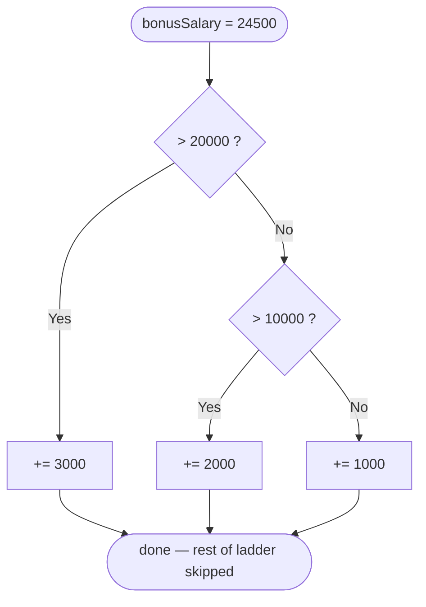
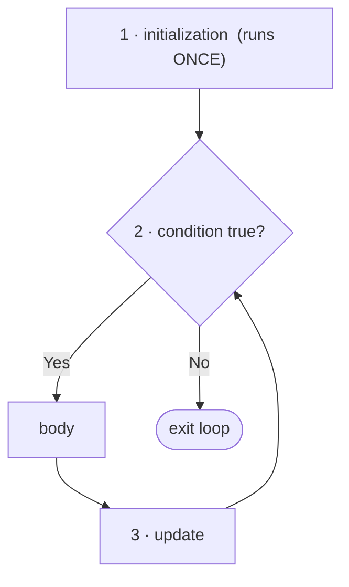

# 5 · Conditionals, Switch & Loops

> 📁 Part 5 of 28 in [Ytube dsa/](README.md) · **Prev:** [04 — Your First Java Program](04-First_Java_Program_Notes.md) · **Next:** [06 — Methods](06-Methods_Notes.md)

## Introduction
Until now every program ran top to bottom, once. This lecture adds the two things that make a program actually *think*: **choosing** which code runs (`if`, ternary, `switch`) and **repeating** code until something says stop (`for`, `while`, `do-while`). Together they are the flowchart diamond and the backwards arrow from [02](02-Flow_Of_Program_Notes.md), turned into Java.

Worked code lives in the course project at `Ytube java dsa/src/com/thowfik/conditionalandloops/`: `Conditionals.java`, `Loops.java`, `CaseCheck.java`, `Largest.java`, `CountNums.java`, `ReverseNum.java`, `Fibonacci.java`. **Every output below is that code compiled and run on JDK 21** — and running it across edge cases turned up three real bugs, called out where they occur.

## Characteristics
- **Conditions must be a real `boolean`:** unlike JavaScript, there is no truthy/falsy. `if (count)` does not compile.
- **First match wins:** an `if / else if` ladder stops at the first true condition, so order matters.
- **`switch` tests exact values, not ranges:** and it comes in five forms, from 1996-style to Java 21 pattern matching.
- **Every loop has three moving parts:** initialization, condition, update. Break any one and the loop misbehaves.
- **At the bytecode level there are no loops:** only conditional jumps backwards — the flowchart arrow, literally.

---

# Part A — Conditionals

## 1. `if`, `if / else`, and the `else if` ladder



```java
int age = 25;
if (age >= 18) {                       // 1. simple if — run or skip
    System.out.println("1. You are an adult.");
}

int salary = 24500;
if (salary > 10000) {                  // 2. if/else — exactly ONE branch runs
    salary += 2000;
} else {
    salary = 1000;
}
System.out.println("2. Salary after if/else = " + salary);

int bonusSalary = 24500;
if (bonusSalary > 20000) {             // 3. ladder — FIRST true condition wins
    bonusSalary += 3000;
} else if (bonusSalary > 10000) {
    bonusSalary += 2000;
} else {
    bonusSalary += 1000;
}
System.out.println("3. Salary after ladder  = " + bonusSalary);
```
**Output**
```
1. You are an adult.
2. Salary after if/else = 26500
3. Salary after ladder  = 27500
```

> 💡 **The one rule: order the ladder narrowest → widest.** 24500 is greater than 20000 *and* greater than 10000. Because `> 20000` is checked first, only that branch runs. Swap the two and `> 10000` swallows every high salary — the `> 20000` branch becomes unreachable, and nothing warns you.

> 💡 Note `+=` vs `=` in example 2: `salary += 2000` adds to the old value; `salary = 1000` throws the old value away.

## 2. Nested `if` — and flattening it with `&&`

```java
int marks = 82;
boolean hasAttendance = true;

if (marks >= 40) {
    if (hasAttendance) {
        System.out.println("4. Passed with attendance -- result published.");
    } else {
        System.out.println("4. Marks are fine, but attendance is short.");
    }
} else {
    System.out.println("4. Failed.");
}

if (marks >= 40 && hasAttendance) {    // same test, one line
    System.out.println("4b. Same result, written with && instead.");
}
```
**Output**
```
4. Passed with attendance -- result published.
4b. Same result, written with && instead.
```

Nest when the inner question **only makes sense once the outer one is true**, and when each level needs its own `else`. Otherwise `&&` is cleaner. More than 2–3 levels deep is a signal to restructure.

## 3. The Ternary Operator `? :`

`condition ? valueIfTrue : valueIfFalse` — a one-line `if/else` that **produces a value**.

```java
String status = (age >= 18) ? "Adult" : "Minor";
System.out.println("5. Status = " + status);

String band = (marks >= 90) ? "Distinction"
            : (marks >= 60) ? "First class"
            : (marks >= 40) ? "Pass" : "Fail";
System.out.println("5b. Band = " + band);
```
**Output**
```
5. Status = Adult
5b. Band = First class
```

Use it to **choose a value**, never to run several statements. Chained ternaries are fine for 2–3 options; past that, write the ladder.

## 4. Operators Inside a Condition

| Kind | Operators |
|---|---|
| Comparison | `>` `<` `>=` `<=` `==` (equal) `!=` (not equal) |
| Logical | `&&` (AND) · `\|\|` (OR) · `!` (NOT) |

**`==` for numbers, `.equals()` for Strings.** The trap is that `==` *sometimes appears to work* on Strings:

```java
String n1 = "Thowfik";
String n2 = new String("Thowfik");
System.out.println("== : " + (n1 == n2));
System.out.println(".equals : " + n1.equals(n2));

String x = "Thowfik";
String y = "Thowfik";
System.out.println("literal == literal : " + (x == y));
```
**Output**
```
== : false
.equals : true
literal == literal : true
```

`==` compares **references** (are these the same object?), `.equals()` compares **text**. Two identical *literals* are true under `==` only because Java stores one shared copy of each literal — the String pool. Text from `new String`, `Scanner`, or string building is a different object, and `==` quietly returns `false`. Code that "worked" in testing then fails on real input. Always `.equals()`.

---

# Part B — `switch`

A ladder tests **ranges** (`>`, `<`, `&&`). A `switch` tests **one value against a list of exact values** — much cleaner when there are many. Java has five forms of it.

## 5. Classic `switch` — and fall-through

```java
int day = 3;
switch (day) {
    case 1:
        System.out.println("6. Monday");
        break;
    case 2:
        System.out.println("6. Tuesday");
        break;
    case 3:
        System.out.println("6. Wednesday");
        break;
    default:
        System.out.println("6. Some other day");
        break;
}
```
**Output**
```
6. Wednesday
```

**Every `case` needs `break`.** Without it, execution keeps running *straight down into the cases below* — no condition is checked. Here is the bug:

```java
int day = 1;
switch (day) {
    case 1: System.out.println("Monday");        // no break
    case 2: System.out.println("Tuesday");       // no break
    case 3: System.out.println("Wednesday"); break;
    default: System.out.println("other");
}
```
**Output**
```
Monday
Tuesday
Wednesday
```

`day` is `1`, yet three days print. But the same behaviour, used **on purpose**, is the standard way to share one body across several values:

```java
int month = 2;
switch (month) {
    case 12:
    case 1:
    case 2:
        System.out.println("7. Winter");   // 12, 1 and 2 all land here
        break;
    case 3:
    case 4:
    case 5:
        System.out.println("7. Summer");
        break;
    default:
        System.out.println("7. Some other season");
}
```
**Output**
```
7. Winter
```

## 6. Arrow `switch` (Java 14+)

Each arm is self-contained — **no fall-through, so no `break`** — and one case can list several values.

```java
switch (day) {
    case 1, 2, 3, 4, 5 -> System.out.println("8. Weekday");
    case 6, 7          -> System.out.println("8. Weekend");
    default            -> System.out.println("8. Not a valid day");
}
```
**Output**
```
8. Weekday
```

Prefer this form in new code. The entire class of forgotten-`break` bugs disappears.

## 7. `switch` Expression + `yield`

A switch that **returns a value**. Note the `=` before it and the `;` after it.

```java
String grade = switch (marks / 10) {
    case 10, 9 -> "A";
    case 8     -> "B";
    case 7     -> "C";
    case 6, 5, 4 -> "D";
    default -> {
        System.out.println("9. (below pass mark)");
        yield "Fail";                  // multi-line arm hands back its value with yield
    }
};
System.out.println("9b. Grade for " + marks + " marks = " + grade);
```
**Output**
```
9b. Grade for 82 marks = B
```

Two tricks at work: `marks / 10` is **integer division** (`82 / 10` = `8`) which turns a range into an exact value `switch` can match; and `case 10, 9` catches a perfect 100 (`100 / 10` = `10`).

**A switch expression must be exhaustive.** Drop the `default` from a switch over an `int` and it will not compile:
```
error: the switch expression does not cover all possible input values
```
> ⚠️ **Nuance to the "`default` is required" rule in `Conditionals.java`:** it is required when the compiler cannot see every possible value — `int`, `String`. Switch over an **enum** and cover every constant, and no `default` is needed:
> ```java
> enum Light { RED, AMBER, GREEN }
> String act = switch (l) { case RED -> "stop"; case AMBER -> "slow"; case GREEN -> "go"; };
> ```
> This compiles and runs. The real rule is *every input covered*; `default` is just the usual way to get there.

## 8. `switch` on a `String` — and what `switch` accepts

```java
String department = "Sales";
switch (department) {
    case "Sales"       -> System.out.println("10. Target-based incentive");
    case "Engineering" -> System.out.println("10. Project-based incentive");
    case "HR"          -> System.out.println("10. Fixed incentive");
    default            -> System.out.println("10. No incentive configured");
}
```
**Output**
```
10. Target-based incentive
```

String cases are **case-sensitive** — with `"SALES"` the output is `no match`. (§19 shows why, from the bytecode.)

**Allowed selector types:** `byte`, `short`, `char`, `int`, their wrappers, `String`, and `enum`. **Not** `long`, `float`, `double`, or `boolean`:
```
error: selector type long is not allowed
error: selector type boolean is not allowed
```

## 9. Pattern Matching (Java 21) — switching on *type*

A case can test what **type** a value is and bind it to a variable in one step. `when` adds a guard.

```java
Object value = 42;

String described = switch (value) {
    case Integer i when i > 100 -> "11. A big number: " + i;
    case Integer i              -> "11. A number: " + i;
    case String s               -> "11. Text of length " + s.length();
    case null                   -> "11. Nothing at all";
    default                     -> "11. Something else";
};
System.out.println(described);

if (value instanceof Integer n && n % 2 == 0) {     // same idea in a plain if
    System.out.println("11b. " + n + " is an even Integer");
}
```
**Output**
```
11. A number: 42
11b. 42 is an even Integer
```

Order matters here too: the guarded `Integer i when i > 100` must come **before** the plain `Integer i`, or the plain one would match every Integer first. And after `instanceof Integer n` passes, `n` is already an `Integer` — no cast.

---

# Part C — Loops

## 10. The Anatomy of Every Loop



1. **Initialization** — the starting point (`i = 1`)
2. **Condition** — re-checked on *every* pass; keep looping while it is true
3. **Update** — how state changes each pass (`i++`), so the condition eventually becomes false

If nothing inside the loop pushes the condition toward false, it never ends.

## 11. `for`, `while`, `do-while`

```java
for (int i = 1; i <= 5; i++) {                     // known number of passes
    System.out.println("1. for loop, i = " + i);
}

int count = 1;
while (count <= 3) {                               // condition checked BEFORE the body
    System.out.println("2. while loop, count = " + count);
    count++;
}

int attempts = 10;                                 // already fails the condition
do {                                               // condition checked AFTER the body
    System.out.println("3. do-while runs at least once, attempts = " + attempts);
    attempts++;
} while (attempts < 5);
```
**Output**
```
1. for loop, i = 1
1. for loop, i = 2
1. for loop, i = 3
1. for loop, i = 4
1. for loop, i = 5
2. while loop, count = 1
2. while loop, count = 2
2. while loop, count = 3
3. do-while runs at least once, attempts = 10
```

| Loop | Condition checked | Minimum passes | Reach for it when |
|---|---|---|---|
| `for` | before each pass | 0 | you know the count up front |
| `while` | before each pass | 0 | you don't know how many passes |
| `do-while` | **after** each pass | **1** | the body must run once before you can test (e.g. show a menu, then ask) |

`attempts = 10` already fails `attempts < 5`, yet the `do-while` body runs once. That single guaranteed pass is its only difference from `while`.

## 12. Enhanced `for` (for-each)

```java
int[] numbers = {10, 20, 30, 40};
for (int n : numbers) {
    System.out.println("4. for-each, n = " + n);
}
```
**Output**
```
4. for-each, n = 10
4. for-each, n = 20
4. for-each, n = 30
4. for-each, n = 40
```

No index, no condition to get wrong. The cost: `n` is a **copy** of each element, so assigning to it changes nothing:

```java
int[] nums = {10, 20, 30};
for (int n : nums) { n = 0; }
System.out.println(java.util.Arrays.toString(nums));
```
```
[10, 20, 30]
```

To modify elements, or when you need the index, use a classic `for`.

## 13. Nested Loops

For every **single** pass of the outer loop, the **entire** inner loop runs to completion.

```java
for (int row = 1; row <= 3; row++) {
    for (int col = 1; col <= 3; col++) {
        System.out.println("5. nested, row=" + row + " col=" + col);
    }
}
```
**Output**
```
5. nested, row=1 col=1
5. nested, row=1 col=2
5. nested, row=1 col=3
5. nested, row=2 col=1
5. nested, row=2 col=2
5. nested, row=2 col=3
5. nested, row=3 col=1
5. nested, row=3 col=2
5. nested, row=3 col=3
```

3 × 3 = **9** prints. This multiplication is where **O(n²)** comes from — two nested loops over *n* items do *n × n* work. Keep that in mind at [[Big-O Intuition]].

## 14. `break`, `continue`, and Labels

```java
int target = 30;
for (int n : numbers) {
    if (n == target) {
        System.out.println("6. found " + target + ", stopping early");
        break;                                  // LEAVE the loop entirely
    }
    System.out.println("6. checked " + n + ", not a match");
}

for (int n : numbers) {
    if (n % 20 == 0) {
        continue;                               // skip the REST of this pass only
    }
    System.out.println("7. not a multiple of 20: " + n);
}
```
**Output**
```
6. checked 10, not a match
6. checked 20, not a match
6. found 30, stopping early
7. not a multiple of 20: 10
7. not a multiple of 20: 30
```

**A plain `break` only exits the innermost loop.** The outer one keeps running:

```java
for (int r = 1; r <= 2; r++) {
    for (int c = 1; c <= 3; c++) {
        if (c == 2) break;                      // exits the INNER loop only
        System.out.println("r=" + r + " c=" + c);
    }
}
```
```
r=1 c=1
r=2 c=1
```

To exit **both**, label the outer loop and break the label:

```java
search:
for (int row = 1; row <= 3; row++) {
    for (int col = 1; col <= 3; col++) {
        if (row == 2 && col == 2) {
            System.out.println("8. found row=2,col=2 -- breaking OUTER loop");
            break search;                       // exits BOTH loops
        }
        System.out.println("8. scanning row=" + row + " col=" + col);
    }
}
```
**Output**
```
8. scanning row=1 col=1
8. scanning row=1 col=2
8. scanning row=1 col=3
8. scanning row=2 col=1
8. found row=2,col=2 -- breaking OUTER loop
```

`continue label` works the same way — it skips to the next pass of the *labeled* loop.

## 15. The Deliberate Infinite Loop

```java
int value = 1;
while (true) {
    if (value > 3) {
        break;                                  // the only way out
    }
    System.out.println("9. infinite loop, value = " + value);
    value++;
}
```
**Output**
```
9. infinite loop, value = 1
9. infinite loop, value = 2
9. infinite loop, value = 3
```

Use `while (true)` when the stopping point is **discovered during** the loop — read input until the user types a valid value, or until a sentinel like `x`. `Largest.java` below uses exactly this for input validation.

---

# Part D — The Programs

## 16. Uppercase or Lowercase? — `CaseCheck.java`

A `char` is secretly its Unicode number, and the letters sit in two unbroken ranges:

| Range | Code points |
|---|---|
| `'A'` … `'Z'` | 65 … 90 |
| `'a'` … `'z'` | 97 … 122 |

So a plain range check on the `char` classifies it — no conversion needed.

```java
Scanner input = new Scanner(System.in);
System.out.print("Enter a single character = ");
char ch = input.next().trim().charAt(0);      // Scanner has no nextChar(): take the first char of a token

if (ch >= 'a' && ch <= 'z') {
    System.out.println(ch + " is a lowercase letter");
} else if (ch >= 'A' && ch <= 'Z') {
    System.out.println(ch + " is an uppercase letter");
} else {
    System.out.println(ch + " is not a letter");
}
```
**Output** *(four separate runs)*
```
Enter a single character = a
a is a lowercase letter

Enter a single character = Z
Z is an uppercase letter

Enter a single character = 5
5 is not a letter

Enter a single character = @
@ is not a letter
```

> 💡 The final `else` is what makes `5` and `@` print anything at all. A ladder with no catch-all silently does nothing for inputs you didn't anticipate.

## 17. Largest of Three — `Largest.java`

Instead of comparing every pair against every other, keep **one "best so far"** and let each remaining value challenge it.

```java
int max = a;             // ASSUME the first is largest
if (b > max) {
    max = b;             // b beats the current best
}
if (c > max) {
    max = c;             // c beats whatever won the previous round
}
System.out.println("Largest = " + max);
```

Input is read through a validating helper — `while (true)` plus `try/catch`, so bad input re-prompts instead of crashing:

```java
private static int readInt(Scanner input, String prompt) {
    while (true) {
        System.out.print(prompt);
        try {
            return Integer.parseInt(input.nextLine());
        } catch (NumberFormatException e) {
            System.out.println("Please enter a single whole number.");
        }
    }
}
```
**Output**
```
Enter the first value = 3
Enter the second value = 9
Enter the third value = 7
Largest = 9
```
With negatives (`-5`, `-2`, `-9`) it prints `Largest = -2`. With bad input:
```
Enter the first value = abc
Please enter a single whole number.
Enter the first value = 4
Enter the second value = 4
Enter the third value = 4
Largest = 4
```

> 💡 **This is the most reused pattern in this file.** Starting `max` at the first element — not at `0` — is why negatives work: seed it with `0` and three negative inputs would wrongly report `0`. Put the comparison inside a loop and it becomes "maximum of an array", one of the first array problems in DSA.

## 18. The Digit-Peeling Pattern — `CountNums.java` & `ReverseNum.java`

Two operations take any integer apart one digit at a time:

| Operation | Gives | `1234` → |
|---|---|---|
| `n % 10` | the **last** digit | `4` |
| `n / 10` | the number **without** its last digit (integer division) | `123` |

Loop until `n` reaches `0` and you visit every digit, right to left. The loop runs once per digit — **O(log₁₀ n)**, not O(n).

### Count occurrences of a digit

```java
Scanner in = new Scanner(System.in);
int n = in.nextInt();
int valueToFind = in.nextInt();
int count = 0;

if (n == 0) {
    if (valueToFind == 0) {
        count = 1;              // 0 has one digit, but the while loop below would never run
    }
} else {
    n = Math.abs(n);            // strip the sign so negatives work
    while (n > 0) {
        int rem = n % 10;
        if (rem == valueToFind) {
            count++;
        }
        n = n / 10;
    }
}
System.out.println(count);
```
**Output** *(input: number, then digit to find)*

| Input | Output |
|---|---|
| `1223342 2` | `3` |
| `0 0` | `1` |
| `-505 5` | `2` |
| `7 3` | `0` |
| `-2147483648 2` | `0` ⚠️ |

> ⚠️ **Bug found while running it: the last row is wrong.** `-2147483648` contains one `2`, but the program prints `0`. That number is `Integer.MIN_VALUE`, and its positive counterpart does not fit in an `int` — so `Math.abs` **returns it unchanged, still negative**:
> ```java
> System.out.println(Math.abs(Integer.MIN_VALUE));   // -2147483648
> ```
> `while (n > 0)` is then false immediately and nothing is counted. The fix is to widen before taking the absolute value: `long m = Math.abs((long) n);`. It is one input out of four billion — which is exactly why it survives testing, and why interviewers ask about it.

### Reverse a number

Same peel, but each digit is **pushed onto the right end** of a growing answer:

```java
private static int reverse(int num) {
    boolean isNegative = num < 0;
    num = Math.abs(num);

    int ans = 0;
    while (num > 0) {
        int rem = num % 10;
        num /= 10;
        ans = ans * 10 + rem;       // shift ans left one place, drop rem in at the end
    }
    return isNegative ? -ans : ans;
}
```

**Trace for `1234`:**

| `rem` | `num` after | `ans = ans*10 + rem` |
|---|---|---|
| — | 1234 | 0 |
| 4 | 123 | 0×10+4 = **4** |
| 3 | 12 | 4×10+3 = **43** |
| 2 | 1 | 43×10+2 = **432** |
| 1 | 0 | 432×10+1 = **4321** |

**Output**

| Input | Output | Why |
|---|---|---|
| `1234` | `4321` | |
| `-560` | `-65` | sign re-applied; the leading zero of `065` vanishes |
| `1200` | `21` | `0021` as an `int` is just `21` — ints can't hold leading zeros |
| `0` | `0` | loop never runs; `ans` stays `0` — correct without a special case |
| `1534236469` | `1056389759` ⚠️ | overflow |

> ⚠️ **The overflow is silent.** The true reverse of `1534236469` is `9646324351` — larger than `Integer.MAX_VALUE` (`2147483647`). Java does not raise an error; `ans * 10` simply wraps around and you get a plausible-looking wrong number. `ReverseNum.java` notes overflow as "not handled here"; this is what it looks like when it happens. The standard guard checks **before** multiplying: `if (ans > (Integer.MAX_VALUE - rem) / 10)` then overflow is about to occur.

## 19. The n-th Fibonacci Number — `Fibonacci.java`

`F(1)=1, F(2)=1, F(3)=2, F(4)=3, F(5)=5, F(6)=8…` — each term is the sum of the two before it.

Instead of storing the whole sequence, keep only the **two most recent** values and slide them forward:

```java
private static int fibonacci(int n) {
    if (n <= 0) {
        return 0;
    }
    if (n == 1 || n == 2) {
        return 1;
    }

    int a = 0;
    int b = 1;
    for (int count = 2; count <= n; count++) {
        int temp = b;        // remember the newer value
        b = b + a;           // compute the next term
        a = temp;            // older catches up to where newer was
    }
    return b;
}
```
**Output**

| `n` | Output |
|---|---|
| 0 | `0` |
| 1 | `1` |
| 2 | `1` |
| 6 | `8` |
| 10 | `55` |
| 46 | `1836311903` |
| 47 | `-1323752223` ⚠️ |

> ⚠️ **Bug found while running it: `n = 47` returns a negative number.** `F(47)` is 2,971,215,073 — past `int`'s ceiling of 2,147,483,647 — so the addition wraps negative. **`F(46)` is the largest Fibonacci number an `int` can hold.** Switching `a`, `b`, `temp` and the return type to `long` pushes the limit to `F(92)` = `7540113804746346429`; `F(93)` overflows `long` too. A negative Fibonacci number is an unmistakable symptom — but most overflow bugs (like `ReverseNum` above) produce positive garbage and are far harder to spot.

**Why this approach — from the comparison in `Fibonacci.java`:**

| Approach | Time | Space |
|---|---|---|
| Naive recursion `fib(n-1) + fib(n-2)` | **O(2ⁿ)** — recomputes the same values endlessly | O(n) call stack |
| Recursion + memoization | O(n) | O(n) cache + O(n) stack |
| Iterative, storing every term in an array | O(n) | O(n) |
| **Iterative rolling pair (this file)** | **O(n)** | **O(1)** |

For a single *n*-th value, the rolling pair wastes nothing. Store the terms (array / memo) only when you need many of them.

---

# Part E — What `switch` and Loops Compile To

Following on from the `.class` walkthrough in [04](04-First_Java_Program_Notes.md) §15: none of these keywords exist in bytecode. Here is what `javac` actually produces (`javap -c -p`).

## 20. `switch` becomes a jump table — or a sorted search

**Dense cases (`1, 2, 3`) → `tableswitch`:**
```
0: iload_0
1: tableswitch   { // 1 to 3
              1: 28
              2: 31
              3: 34
        default: 37
   }
```
An array of jump targets indexed directly by the value — **O(1)**, no comparisons at all.

**Sparse cases (`1, 500, 90000`) → `lookupswitch`:**
```
1: lookupswitch  { // 3
              1: 36
            500: 39
          90000: 42
        default: 45
   }
```
A table of 90,000 slots would be wasteful, so the compiler stores **sorted key/target pairs** and the JVM searches them — **O(log n)**. This is why a `switch` can outperform a long `else if` ladder: the ladder always tests conditions one by one, top to bottom.

## 21. A `String` switch is really two switches

```
 4: aload_1
 5: invokevirtual #21   // Method java/lang/String.hashCode:()I
 8: lookupswitch  { // 2
           2314: 50     // "HR".hashCode()
       79649004: 36     // "Sales".hashCode()
        default: 61
    }
36: aload_1
37: ldc           #27   // String Sales
39: invokevirtual #29   // Method java/lang/String.equals:(Ljava/lang/Object;)Z
...
62: lookupswitch  { // 2
              0: 88
              1: 91
        default: 94
    }
```
1. Call `hashCode()` on the selector and jump on the **number**
2. Confirm with `equals()` — two different strings can share a hash code
3. Switch again on the resulting case index

This explains two behaviours from §8. String cases are **case-sensitive** because `"SALES"` and `"Sales"` have different hash codes. And a **`null`** selector in a classic String switch throws `NullPointerException`, because step 1 calls `hashCode()` on it — which is exactly why Java 21 added `case null`.

## 22. A `for` loop is a conditional jump backwards

```java
int sum = 0;
for (int i = 1; i <= 5; i++) { sum += i; }
```
```
 2: iconst_1
 3: istore_1          // i = 1                         (initialization)
 4: iload_1
 5: iconst_5
 6: if_icmpgt  19     // if i > 5, jump OUT to 19       (condition, inverted)
 9: iload_0
10: iload_1
11: iadd
12: istore_0          // sum = sum + i                  (body)
13: iinc  1, 1        // i++                            (update)
16: goto   4          // jump BACK to the condition
19: iload_0
```
There is no `for` instruction. The condition `i <= 5` is compiled as its **inverse** — "jump out if `i > 5`" — and the loop is closed by a plain **`goto` backwards**. A `while` loop compiles to the same shape. This is the backwards arrow from the flowcharts in [02](02-Flow_Of_Program_Notes.md), one-to-one.

---

## ⚠️ Common Misunderstandings
**1. `if (salary = 10000)` is always caught by the compiler.**
❌ always an error · ✅ only when the variable isn't a `boolean`.
For an `int` you get `error: incompatible types: int cannot be converted to boolean`. But for a boolean it **compiles and runs**:
```java
boolean isAdmin = false;
if (isAdmin = true) { System.out.println("granted admin! (isAdmin is now " + isAdmin + ")"); }
```
```
granted admin! (isAdmin is now true)
```
*Why:* `isAdmin = true` assigns, then evaluates to `true`. Write `if (isAdmin)`, never `== true`, and the typo can't happen.

**2. A stray semicolon after `if`.**
❌ `if (age >= 18); { ... }` · ✅ no `;` after the condition.
With `age = 10`, the block still prints. *Why:* the `;` is an empty statement that *is* the if's body; the braces after it are an unrelated block that always runs. No error, wrong result.

**3. Dropping the braces.**
❌ `if (age >= 18) System.out.println("a"); System.out.println("b");` · ✅ braces always.
Only `"a"` belongs to the `if` — `b` prints regardless. *Why:* without braces an `if` governs exactly one statement; indentation means nothing to Java.

**4. The stray-semicolon `for` example in `Loops.java`, as written.**
❌ `for (int i = 0; i < 5; i++); { System.out.println(i); }` "runs once with the final `i`" · ✅ as written it **doesn't compile**: `error: cannot find symbol`.
*Why:* `i` is declared *in the loop header*, so it only exists inside the loop — and the `;` means the loop has already ended. The "runs once, prints 5" behaviour needs `i` declared before the loop: `int i; for (i = 0; i < 5; i++); { ... }` prints `body ran once, i = 5`. Same underlying bug, but the compiler catches one version and not the other.

**5. Comparing Strings with `==`.**
❌ `name == "Thowfik"` · ✅ `name.equals("Thowfik")`.
*Why:* `==` compares references. It passes for two literals (shared pool copy) and fails for input read from `Scanner` — so it "works" in testing and breaks in use.

**6. Forgetting `break` in a classic switch.**
❌ assumes only the matching case runs · ✅ execution falls into every case below until a `break`.
With `day = 1` and no breaks: `Monday`, `Tuesday`, `Wednesday`. Use the arrow form and the problem disappears.

**7. `default` is always mandatory in a switch expression.**
❌ always · ✅ only when not every value is covered — an enum with every constant handled needs none.

**8. Switching on a `long` or `boolean`.**
❌ works like `int` · ✅ `error: selector type long is not allowed`. Use an `if` ladder.

**9. Modifying an array through the for-each variable.**
❌ `for (int n : nums) { n = 0; }` zeroes the array · ✅ still `[10, 20, 30]`. `n` is a copy.

**10. Off-by-one with `<=` on array length.**
❌ `for (int i = 0; i <= arr.length; i++)` · ✅ `i < arr.length`.
```
Exception in thread "main" java.lang.ArrayIndexOutOfBoundsException: Index 3 out of bounds for length 3
```
*Why:* valid indexes run `0` to `length - 1`.

**11. `break` inside nested loops exits everything.**
❌ exits all loops · ✅ exits only the innermost. Label the outer loop to leave both.

**12. A variable declared inside an `if` exists after it.**
❌ `if (true) { int inner = 5; } System.out.println(inner);` · ✅ `error: cannot find symbol`. Declare it before the block.

**13. `Math.abs` always returns a non-negative number.**
❌ always · ✅ `Math.abs(Integer.MIN_VALUE)` is `-2147483648`. Widen to `long` first.

**14. Integer overflow throws an error.**
❌ Java stops you · ✅ it **wraps silently**: `Fibonacci(47)` → `-1323752223`, reversing `1534236469` → `1056389759`.

## JavaScript Comparison
| | Java | JavaScript |
|---|---|---|
| Condition type | must be a real `boolean` — `if (count)` won't compile | truthy/falsy — `if (0)`, `if ("")` are valid |
| Equality | `==` on objects compares **references**; use `.equals()` | `===` compares string **values** (strings are primitives) |
| `switch` matching | exact value; classic form falls through | strict `===`; always falls through |
| Arrow `switch` / switch expression | yes (Java 14+) | no |
| Switch on type | pattern matching, Java 21 | none — `typeof` / `instanceof` checks |
| for-each | `for (int n : arr)` | `for (const n of arr)` — ⚠️ `for…in` gives **keys** |
| Labeled `break` | yes | yes — same syntax |
| `1234 / 10` | `123` (integer division) | `123.4` — need `Math.trunc` |
| Integer overflow | wraps silently: `-1323752223` | numbers are doubles; lose precision beyond 2⁵³ instead |
| `do-while` | yes | yes — identical |

> 💡 Digit peeling is where the JS habit bites. `while (n > 0) { n = n / 10; }` works in Java because `/` truncates. The same line in JS produces `123.4`, `12.34`, `1.234`, `0.1234`… and takes **327** iterations to finally reach `0` (verified in Node, starting from `1234`).

## Interview Angles
- **"Reverse an integer"** (LeetCode 7) *is* `ReverseNum.java` — and the whole question is the overflow. Say the guard out loud: check `ans > (Integer.MAX_VALUE - rem) / 10` **before** the multiply.
- **"Nth Fibonacci — give me all the approaches"** — naive recursion O(2ⁿ) → memoized O(n)/O(n) → rolling pair O(n)/O(1). Then volunteer: *"and `int` overflows at n = 47, so I'd use `long`."* That last sentence is what separates candidates.
- **"Count the digits of a number"** — `% 10` / `/ 10` loop, O(log₁₀ n). Edge cases they probe: `0` (loop never runs), negatives, `Integer.MIN_VALUE`.
- **"`while` vs `do-while`?"** — `do-while` checks after the body, so it always runs at least once.
- **"`break` vs `continue`?"** — leave the loop vs skip to the next pass. Follow-up: how to exit two nested loops → labeled `break`.
- **"Is `switch` faster than `if/else`?"** — potentially: dense cases compile to `tableswitch` (O(1) jump), sparse ones to `lookupswitch` (O(log n)), while a ladder is always sequential. Knowing the bytecode names is a strong signal.
- **"How does a `switch` on a `String` work?"** — `hashCode()` → `lookupswitch` → `equals()` to confirm. Explains case-sensitivity and the `NullPointerException` on `null`.

## Related · Next
- **Related:** [[First Java Program]] (04 — the `.class` walkthrough this builds on) · [[Flow of the Program]] (02 — the diamond and the backwards arrow) · [[Conditionals]] (0.3) · [[Loops]] (0.4) · [[Big-O Intuition]] (1.1 — nested loops → O(n²), digit loops → O(log n))
- **Practice:** fix the three bugs yourself before reading the fixes again — `Math.abs((long) n)` in `CountNums`, `long` in `Fibonacci`, the overflow guard in `ReverseNum`. Then write "sum of digits" and "is it a palindrome number" using the same peel; the palindrome check is just `reverse(n) == n`.
- **Next:** continue the playlist; new lectures become `06-…`

---

## 🔁 Rapid Revision (self-test)
Answer out loud **before** expanding.

<details><summary>1. Why must an if/else-if ladder be ordered narrowest to widest?</summary>

Java stops at the first true condition. If a wide condition (`> 10000`) comes before a narrow one (`> 20000`), the wide one catches every value first and the narrow branch can never run — with no warning.
</details>

<details><summary>2. Why does `"a" == "a"` print true but `==` on Scanner input fail?</summary>

`==` compares references. Identical literals share one copy in the String pool, so they're the same object. Text from `Scanner` or `new String` is a separate object with the same content — `==` is false. Always `.equals()`.
</details>

<details><summary>3. What prints for `day = 1` in a classic switch with no breaks?</summary>

`Monday`, `Tuesday`, `Wednesday` — execution falls through every case below the match until it hits a `break`. Intentional stacking (`case 12: case 1: case 2:`) uses the same mechanism to share a body.
</details>

<details><summary>4. What does the arrow form `case 1, 2 ->` fix?</summary>

No fall-through, so no `break` is needed, and several values can share one case. The forgotten-`break` bug can't happen.
</details>

<details><summary>5. When is `default` required in a switch expression, and when isn't it?</summary>

When the compiler can't see every possible value — `int`, `String` — it's required (`error: the switch expression does not cover all possible input values`). An enum with every constant covered needs no `default`.
</details>

<details><summary>6. Which types can a switch not use?</summary>

`long`, `float`, `double`, `boolean` — `error: selector type long is not allowed`. Allowed: `byte`, `short`, `char`, `int`, their wrappers, `String`, `enum`, and (Java 21) any type via pattern matching.
</details>

<details><summary>7. `while` vs `do-while` — the one difference?</summary>

`do-while` checks its condition after the body, so the body always runs at least once — even when the condition is false from the start.
</details>

<details><summary>8. Why doesn't `for (int n : nums) { n = 0; }` change the array?</summary>

`n` is a copy of each element, not a reference into the array. Use a classic indexed `for` to modify elements.
</details>

<details><summary>9. How do you exit two nested loops at once?</summary>

Label the outer loop (`search:`) and `break search;`. A plain `break` only exits the innermost loop.
</details>

<details><summary>10. What do `n % 10` and `n / 10` give, and what's the complexity of peeling every digit?</summary>

The last digit, and the number with its last digit removed (integer division). The loop runs once per digit: O(log₁₀ n).
</details>

<details><summary>11. Why does CountNums print 0 for -2147483648?</summary>

That's `Integer.MIN_VALUE`, whose positive value doesn't fit in an `int`, so `Math.abs` returns it unchanged — still negative. `while (n > 0)` never runs. Fix: `Math.abs((long) n)`.
</details>

<details><summary>12. What does Fibonacci(47) return with int, and what's the fix?</summary>

`-1323752223` — F(47) exceeds `Integer.MAX_VALUE` and the addition wraps. `F(46)` is the largest that fits. Use `long` (good up to F(92)).
</details>

<details><summary>13. What does a switch over 1, 2, 3 compile to vs one over 1, 500, 90000?</summary>

Dense → `tableswitch`, a direct jump table, O(1). Sparse → `lookupswitch`, sorted key/target pairs searched in O(log n).
</details>

<details><summary>14. How does a String switch work in bytecode, and what does that explain?</summary>

`hashCode()` → `lookupswitch` on the number → `equals()` to confirm → a second switch on the case index. Explains case-sensitivity (different hash codes) and why a `null` selector throws `NullPointerException` in a classic switch.
</details>

<details><summary>15. What does a for loop look like in bytecode?</summary>

No loop instruction exists. The condition is compiled inverted (`if_icmpgt` = "jump out if i > 5"), then the body, the update (`iinc`), and a `goto` back to the condition — the flowchart's backwards arrow.
</details>
