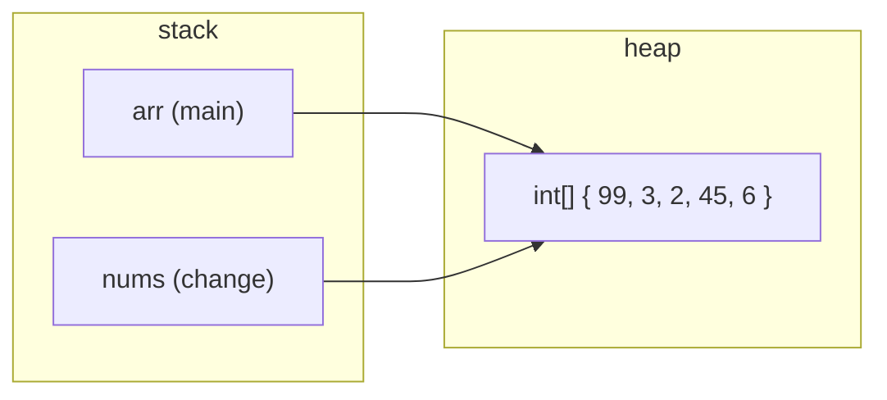

# 6 · Methods (Functions)

> 📁 Part 6 of 6 in [Ytube dsa/](README.md) · **Prev:** [05 — Conditionals, Switch & Loops](05-Conditionals_and_Loops_Notes.md)

## Introduction
A **method** is a named block of code you can call by name, hand values to, and get a value back from. It is the first tool for *not repeating yourself* — and the lecture makes that point brutally: `07-methods/code/src/com/kunal/Main.java` solves "read two numbers and print their sum" by **copy-pasting the same five lines eleven times**.

```java
System.out.print("Enter number 1: ");
num1 = in.nextInt();
System.out.print("Enter number 2: ");
num2 = in.nextInt();
sum = num1 + num2;
System.out.println("The sum = " + sum);
// ...and again, and again, eleven times over
```

Every problem with that file — change the wording and you edit eleven places, fix a bug and you must fix it eleven times — is what methods exist to solve. Beyond reuse, they give you the vocabulary the rest of DSA is written in: **the call stack**, which is what makes [[Recursion]] possible.

## Characteristics of a Method
- **Named and reusable:** write the logic once, call it from anywhere, any number of times.
- **Typed in and out:** every parameter has a type, and the method declares exactly one return type.
- **Isolated scope:** variables inside a method are invisible outside it.
- **Java passes by value, always:** the method gets a *copy* — even when what's copied is a reference.
- **Resolved at compile time:** which overload you called is decided by `javac`, not at runtime.

---

## 1. Anatomy of a Method

```
return_type  name (parameters) {
    // body
    return value;
}
```

```java
public class Greeting {
    public static void main(String[] args) {
        greeting();                       // the CALL
    }

    static void greeting() {              // the DECLARATION
        System.out.println("Hello World");
    }
}
```
**Output**
```
Hello World
```

- **`static`** — belongs to the class, so `main` (itself static) can call it without creating an object (§10).
- **`void`** — hands nothing back. Any other return type *must* hand back a value of that type.
- **`greeting`** — the name you call it by. Convention: `camelCase`, and a **verb** (`calculateSum`, `isPrime`).
- **`()`** — the parameter list, empty here.

> 💡 **Parameter vs argument:** the *parameter* is the variable in the declaration (`int a`); the *argument* is the actual value you pass at the call (`3`). The lecture code uses `naam` as a parameter name while the caller's variable is `chacha` — a useful reminder that the two names are completely independent.

## 2. Three Evolutions of the Same Task — `Sum.java`

The lecture shows the same job written three ways, each better than the last.

```java
// v1 — does everything itself, returns nothing. Not reusable: it can only print.
static void sum() {
    Scanner in = new Scanner(System.in);
    System.out.print("Enter number 1: ");
    int num1 = in.nextInt();
    System.out.print("Enter number 2: ");
    int num2 = in.nextInt();
    int sum = num1 + num2;
    System.out.println("The sum = " + sum);
}

// v2 — RETURNS the answer, so the caller decides what to do with it.
static int sum2() {
    Scanner in = new Scanner(System.in);
    /* ...read num1, num2... */
    return sum;
}

// v3 — takes its inputs as PARAMETERS. No Scanner, no printing: pure computation.
static int sum3(int a, int b) {
    int sum = a + b;
    return sum;
}
```
```java
int ans = sum3(20, 30);
System.out.println(ans);
```
**Output**
```
50
```

**v3 is the one to imitate.** A method that takes its inputs as parameters and returns a result is testable, reusable, and callable in a loop. A method that reads its own input and prints its own output can only ever do that one thing. Every DSA solution you write will be shaped like `sum3`.

## 3. `return` Ends the Method Immediately

`Sum.java` carries a commented-out line that is worth uncommenting to see what happens:

```java
static int sum2() {
    /* ... */
    return sum;
    System.out.println("This will never execute");
}
```
```
error: unreachable statement
```

`javac` refuses to compile code that can never run. And a method with a return type must return on **every** path:

```java
static int f(int a) {
    if (a > 0) {
        return 1;
    }
}
```
```
error: missing return statement
```
There is no `else`, so a caller passing `-1` would reach the closing brace with no value to hand back. Java rejects it at compile time rather than inventing a default.

## 4. Pass by Value — the Big One

> **Java is always pass-by-value.** A method receives a *copy* of what you passed. The confusion comes from objects: what gets copied there is the **reference**, not the object.

### Primitives — the copy is independent

```java
public class Swap {
    public static void main(String[] args) {
        int a = 10;
        int b = 20;
        swap(a, b);
        System.out.println(a + " " + b);

        String name = "Kunal Kushwaha";
        changeName(name);
        System.out.println(name);
    }

    static void swap(int num1, int num2) {
        int temp = num1;
        num1 = num2;
        num2 = temp;                 // only num1/num2 change — they are copies
    }

    static void changeName(String naam) {
        naam = "Rahul Rana";         // reassigns the local copy of the reference
    }
}
```
**Output**
```
10 20
Kunal Kushwaha
```

The swap genuinely happens — **inside `swap`**. `num1` and `num2` are copies living in that method's own stack frame, and they vanish when it returns. `a` and `b` never move.

`changeName` fails for a subtler reason. `naam` is a copy of the *reference*. Assigning to it re-points that copy at a new String; the caller's `name` still points at the original. (Strings are also immutable, so there is no way to alter the original in place even if you wanted to.)

### Objects — the copy points at the same thing

```java
public class ChangeValue {
    public static void main(String[] args) {
        int[] arr = {1, 3, 2, 45, 6};
        change(arr);
        System.out.println(Arrays.toString(arr));
    }

    static void change(int[] nums) {
        nums[0] = 99;                // follows the reference to the SAME array
    }
}
```
**Output**
```
[99, 3, 2, 45, 6]
```



Both variables hold **the same address**. `nums[0] = 99` walks that address to the one array on the heap and edits it — visible to everyone. But `nums = new int[]{...}` would only re-point the local copy, exactly like `changeName`.

> 💡 **The rule in one line:** you can always **modify** the object a reference points to, but you can never **re-point** the caller's variable. This is the stack/heap model from note 01 doing real work, and it is a guaranteed interview question.

## 5. Scope — Where a Variable Exists

```java
public class Scope {
    public static void main(String[] args) {
        int a = 10;
        int b = 20;
        String name = "Kunal";
        {
            a = 100;                 // reassigning an OUTER variable: fine
            System.out.println(a);
            int c = 99;              // born here, dies at the closing brace
            name = "Rahul";
            System.out.println(name);
        }
        int c = 900;                 // legal: the other c no longer exists
        System.out.println(a);
        System.out.println(name);
    }
}
```
**Output**
```
100
Rahul
100
Rahul
```

Three rules, all verified:

| Rule | Evidence |
|---|---|
| A variable declared in a block dies at that block's `}` | `{ int c = 99; } System.out.println(c);` → `error: cannot find symbol` |
| You may **reassign** an outer variable from inside a block | `a = 100` sticks after the block — both prints show `100` |
| You may **not redeclare** it while it is still in scope | `int a = 78;` inside the block → compile error (the lecture leaves this commented out) |

The same applies to loops: `for (int i = ...)` and anything declared in the body exist only inside the loop. That is why the stray-semicolon example in note 05 fails to compile.

## 6. Shadowing — a Local Hiding a Class Variable

```java
public class Shadowing {
    static int x = 90;                       // class variable

    public static void main(String[] args) {
        System.out.println(x);               // 90 — the class variable
        int x;                               // shadows it from here on
        x = 40;
        System.out.println(x);               // 40 — the local
        fun();
    }

    static void fun() {
        System.out.println(x);               // 90 — fun() can't see main's local
    }
}
```
**Output**
```
90
40
90
```

**Shadowing** is a local variable taking a name already used by a class variable. Inside that scope, the name means the local; everywhere else it still means the class variable — which is why `fun()` prints `90`.

> ⚠️ A shadowing declaration doesn't take effect until it is **initialized**. Printing between `int x;` and `x = 40;` gives:
> ```
> error: variable x might not have been initialized
> ```
> It no longer means the class variable (the local has taken the name), but the local has no value yet. Local variables, unlike fields, get **no default** — Java will not let you read one before you write it.

## 7. Overloading — Same Name, Different Parameters

```java
static int sum(int a, int b)          { return a + b; }
static int sum(int a, int b, int c)   { return a + b + c; }

static void fun(int a)     { System.out.println("first one");  }
static void fun(String s)  { System.out.println("Second one"); }
```
```java
int ans = sum(3, 4, 78);
System.out.println(ans);
```
**Output**
```
85
```

Java picks the method by the **number and types of arguments**. Two ways to overload:

| Vary | Example |
|---|---|
| **Count** of parameters | `sum(int,int)` vs `sum(int,int,int)` |
| **Type** of parameters | `fun(int)` vs `fun(String)` |

**Return type alone is not enough:**
```java
static int    f(int a) { return a; }
static double f(int a) { return a; }
```
```
error: method f(int) is already defined in class RetTypeOverload
```
*Why:* at the call site `f(1)`, the compiler sees only the arguments. It has no way to tell which you meant — so the signature (name + parameter types) must be unique.

**Two resolution rules worth knowing:**

```java
static void f(long v)   { System.out.println("long");   }
static void f(double v) { System.out.println("double"); }
f(5);                    // an int — which wins?
```
```
long
```
Given a choice, Java picks the **narrowest type the argument fits into** — `int` → `long` before `int` → `double`.

```java
static void f(int a)     { System.out.println("exact int"); }
static void f(int ...v)  { System.out.println("varargs");   }
f(5);
```
```
exact int
```
An **exact match always beats varargs**. Varargs is the last resort.

## 8. Varargs — "Any Number of Arguments"

```java
static void fun(int ...v) {
    System.out.println(Arrays.toString(v) + " length=" + v.length);
}

fun();
fun(1);
fun(1, 2, 3);
```
**Output**
```
[] length=0
[1] length=1
[1, 2, 3] length=3
```

Inside the method, `v` is simply an **array**. Calling with no arguments gives an **empty array, never `null`** — so `v.length` is always safe.

**Two hard rules:**

```java
static void f(int ...v, String s) { }      // varargs not last
static void f(int ...a, String ...b) { }   // two varargs
```
```
error: varargs parameter must be the last parameter
error: varargs parameter must be the last parameter
```
A varargs parameter must be **last**, and there can be only **one** — otherwise the compiler couldn't tell where one list stops and the next begins. `static void multiple(int a, int b, String ...v)` in the lecture code is the legal shape: fixed parameters first, varargs last.

> ⚠️ **Why `VarArgs.java` has every call commented out.** The file declares both `demo(int ...v)` and `demo(String ...v)`, then calls `demo()`:
> ```
> error: reference to demo is ambiguous
> ```
> With no arguments, an empty `int[]` and an empty `String[]` are equally valid — the compiler cannot choose. Two varargs overloads of the same name are a trap; uncommenting that line is what it looks like.

## 9. The Programs — `Questions.java`

**Armstrong numbers** (a 3-digit number equal to the sum of the cubes of its digits) — the digit-peeling loop from note 05, now wrapped in a reusable method:

```java
static boolean isArmstrong(int n) {
    int original = n;
    int sum = 0;
    while (n > 0) {
        int rem = n % 10;
        n = n / 10;
        sum = sum + rem * rem * rem;
    }
    return sum == original;
}

for (int i = 100; i < 1000; i++) {
    if (isArmstrong(i)) {
        System.out.print(i + " ");
    }
}
```
**Output**
```
153 370 371 407
```

Note the shape: `isArmstrong` **returns a boolean** and prints nothing. That is what lets it sit inside an `if` inside a `for`. Had it printed instead of returning (the `sum()` v1 mistake), this loop would be impossible.

> 💡 `int original = n;` is essential — the loop destroys `n` as it peels digits, so the original value has to be saved before comparing. Same pattern as `ReverseNum` in note 05.

## 10. `static` — Why Every Method Here Has It

```java
public class StaticCallsInstance {
    void helper() { }
    public static void main(String[] a) { helper(); }
}
```
```
error: non-static method helper() cannot be referenced from a static context
```

`main` is `static`, so it runs without any object of the class existing. A **non-static** method belongs to an object — and there is none to call it on. Until objects arrive (the OOP lectures), mark helper methods `static` and they will be callable from `main`.

## 11. What a Method Call Looks Like in Bytecode

Continuing the `.class` thread from notes 04 and 05 (`javap -c -p`):

```java
int x = sum(3, 4);
int y = sum(3, 4, 78);
fun(1, 2, 3);
fun();
```
```
 0: iconst_3
 1: iconst_4
 2: invokestatic  #7    // Method sum:(II)I
 5: istore_1
 6: iconst_3
 7: iconst_4
 8: bipush        78
10: invokestatic  #13   // Method sum:(III)I
13: istore_2
14: iconst_3
15: newarray      int          <-- varargs builds an ARRAY at the call site
17: dup
18: iconst_0
19: iconst_1
20: iastore                    <-- v[0] = 1
...
29: invokestatic  #16   // Method fun:([I)V
32: iconst_0
33: newarray      int          <-- fun() with NO args: an EMPTY array
35: invokestatic  #16   // Method fun:([I)V
```

Three things this proves:

**(a) Overloading is resolved at compile time.** The two calls target `sum:(II)I` and `sum:(III)I` — *different constant-pool entries*. Nothing is decided at runtime; `javac` baked the exact method in. Descriptors (from `javap -s`):

| Method | Descriptor |
|---|---|
| `static int sum(int, int)` | `(II)I` |
| `static int sum(int, int, int)` | `(III)I` |
| `static void fun(int...)` | `([I)V` |

That is also *why* return type can't distinguish overloads: the compiler chooses using the argument types only.

**(b) Varargs really is an array.** `fun(1,2,3)` compiles to `newarray int` plus three `iastore` — the caller builds the array, then passes it. `fun(int...)` and `fun(int[])` have the identical descriptor `([I)V`, which is why you cannot declare both.

**(c) `fun()` allocates an empty array on every call** (`iconst_0; newarray int`). Harmless here, but it is why a varargs method called in a hot loop is measurably slower than a fixed-parameter one.

> 💡 `invokestatic` appears because these methods are `static`. Instance methods use `invokevirtual` — the same instruction you saw calling `println` in note 04.

## 12. Where Methods Lead: the Call Stack

Every call pushes a **stack frame** holding that call's parameters and local variables; returning pops it. That is the mechanism behind everything in this note:

- `swap`'s `num1`/`num2` live in *its* frame and die when it returns — §4
- `fun()` can't see `main`'s local `x`, because it is a different frame — §6
- a block's variables die at `}` for the same reason — §5

It is also why [[Recursion]] works at all: a method calling itself simply pushes another frame, each with its own copy of the locals. When recursion arrives, none of that will be new — it is this note, applied to itself.

---

## ⚠️ Common Misunderstandings
**1. "Java is pass-by-reference for objects."**
❌ pass-by-reference · ✅ **always pass-by-value** — for objects, the *reference* is what gets copied.
*Why:* you can modify the object (`nums[0] = 99` → `[99, 3, 2, 45, 6]`) but never re-point the caller's variable (`naam = "Rahul Rana"` leaves `name` untouched).

**2. "`swap(a, b)` swaps my variables."**
❌ swaps the caller's values · ✅ prints `10 20` — the swap happened to copies.
*Why:* to actually swap, return the values, pass an array/object, or use two fields.

**3. Code after `return`.**
❌ runs as cleanup · ✅ `error: unreachable statement`.

**4. A method with a return type that returns only in an `if`.**
❌ compiles · ✅ `error: missing return statement` — every path must return.

**5. Overloading by return type.**
❌ `int f(int)` + `double f(int)` · ✅ `error: method f(int) is already defined`.
*Why:* the call site only offers argument types; the signature must be unique without the return type.

**6. Redeclaring a variable in an inner block.**
❌ `int a = 78;` inside a block where `a` exists · ✅ reassign (`a = 100`) instead.
*Why:* the outer `a` is still in scope. (Declaring `int c = 900` **after** the block is fine — that `c` is gone.)

**7. Reading a shadowing local before initializing it.**
❌ falls back to the class variable · ✅ `error: variable x might not have been initialized`.
*Why:* the name already means the local; locals get no default value.

**8. Varargs can sit anywhere in the parameter list.**
❌ `f(int ...v, String s)` · ✅ `error: varargs parameter must be the last parameter`. Only one, always last.

**9. Varargs with no arguments gives `null`.**
❌ `null` · ✅ an **empty array** — `[] length=0`. Safe to call `.length` on.

**10. Two varargs overloads are fine.**
❌ `demo(int...)` + `demo(String...)` · ✅ legal to declare, but `demo()` → `error: reference to demo is ambiguous`.

**11. Calling an instance method from `main`.**
❌ works · ✅ `error: non-static method helper() cannot be referenced from a static context`. Mark it `static`.

## JavaScript Comparison
| | Java | JavaScript |
|---|---|---|
| Declaring | `static int sum(int a, int b) { }` — types required | `function sum(a, b) { }` |
| Return type | declared, enforced on every path | whatever you return; `undefined` by default |
| Overloading | yes — by parameter count/type | **no** — a later definition replaces the earlier one |
| Default parameters | no (overload instead) | `function f(a = 5)` |
| Varargs | `int ...v` — an array, last parameter only | `...rest` — a real array, same restriction |
| Passing | always by value (references copied) | identical semantics |
| Modifying an argument's object | visible to the caller | visible to the caller |
| Re-pointing a parameter | invisible to the caller | invisible to the caller |
| Scope | block-scoped; no hoisting | `let`/`const` block-scoped; `var` function-scoped and hoisted |
| Reading an uninitialized local | compile error | `undefined` (or a TDZ error for `let`) |

> 💡 The pass-by-value semantics are **exactly the same** in both languages — JS developers just never have to name it, because there are no primitives-vs-objects declarations to make it visible. The genuinely new things here are overloading and compile-time checking.

## Interview Angles
- **"Is Java pass-by-value or pass-by-reference?"** — Near-guaranteed. Answer: *always pass-by-value; for objects the value copied is the reference.* Then give both halves of the proof: mutating an array through a parameter **is** visible; reassigning the parameter is **not**.
- **"Why can't you overload on return type?"** — The compiler picks the method from the call site's argument types; `javap` shows the descriptor `(II)I` baked in at compile time.
- **"What's a stack frame / what happens when you call a method?"** — Parameters and locals are pushed in a new frame, popped on return. Leads straight into recursion and `StackOverflowError`.
- **"Difference between overloading and overriding?"** — Overloading is compile-time, same class, different parameters. Overriding is runtime, subclass, same signature. (Overriding arrives with OOP.)
- **"What does `static` mean?"** — Belongs to the class, not an instance; callable without an object, and cannot touch instance state.
- **"Any cost to varargs?"** — Yes: an array is allocated at every call, even an empty one. Worth avoiding in a hot loop.

## Related · Next
- **Related:** [[Conditionals and Loops]] (05 — the loops these methods wrap) · [[First Java Program]] (04 — the `main` signature, now explicable) · [[Introduction to Programming]] (01 — the stack/heap model §4 depends on) · [[Recursion]] (the call stack applied to itself)
- **Practice:** rewrite the eleven-times-repeated `Main.java` as a single method called in a loop. Then write `isPrime(int)` returning a boolean and use it to print all primes below 100 — the `isArmstrong` shape, reused.
- **Next:** `07` — Arrays & ArrayList (bootcamp lecture 08)

---

## 🔁 Rapid Revision (self-test)
Answer out loud **before** expanding.

<details><summary>1. What's wrong with the lecture's Main.java, and what fixes it?</summary>

It copy-pastes the same read-two-numbers-and-sum block eleven times. One edit becomes eleven edits, one bug becomes eleven bugs. A single method called in a loop fixes it.
</details>

<details><summary>2. Parameter vs argument?</summary>

The parameter is the variable in the declaration (`int a`); the argument is the value passed at the call (`3`). Their names are independent.
</details>

<details><summary>3. Why is `sum3(int a, int b)` better than `sum()` that reads input and prints?</summary>

It takes inputs as parameters and returns a result, so it is reusable, testable, and callable in a loop. A method that does its own I/O can only ever do that one thing.
</details>

<details><summary>4. Java: pass-by-value or pass-by-reference?</summary>

**Always pass-by-value.** For objects, the value copied is the reference — so you can modify the object but never re-point the caller's variable.
</details>

<details><summary>5. Why does `swap(a, b)` print `10 20`, but `change(arr)` print `[99, 3, 2, 45, 6]`?</summary>

`swap` gets copies of the ints and swaps those copies. `change` gets a copy of the *reference*, which still points at the same heap array, so `nums[0] = 99` edits the one real array.
</details>

<details><summary>6. What happens with code after `return`, or a return type that only returns inside an `if`?</summary>

`error: unreachable statement` and `error: missing return statement` — both refused at compile time.
</details>

<details><summary>7. Can you reassign an outer variable inside a block? Redeclare it?</summary>

Reassign yes (`a = 100` persists after the block). Redeclare no, while it's still in scope. A variable declared inside the block dies at `}`.
</details>

<details><summary>8. In Shadowing.java, why do the three prints give 90, 40, 90?</summary>

First print: the class variable. After `int x;` the local shadows it, so the second shows `40`. `fun()` is a different frame that can't see main's local, so it reads the class variable: `90`.
</details>

<details><summary>9. Two ways to overload — and one that doesn't work?</summary>

By parameter count and by parameter type. Return type alone fails: `error: method f(int) is already defined`.
</details>

<details><summary>10. `f(long)` and `f(double)` both exist — which does `f(5)` call, and why?</summary>

`f(long)`. Java picks the narrowest type the argument widens into.
</details>

<details><summary>11. What is `v` inside `fun(int ...v)`, and what is `fun()`?</summary>

An array. With no arguments it is an **empty** array (`[] length=0`), never `null` — bytecode shows `iconst_0; newarray int`.
</details>

<details><summary>12. Why are all the calls in VarArgs.java commented out?</summary>

It declares `demo(int...)` and `demo(String...)`; the call `demo()` is `error: reference to demo is ambiguous`, since an empty `int[]` and an empty `String[]` are equally valid.
</details>

<details><summary>13. Why must helper methods be `static` right now?</summary>

`main` is static and runs with no object in existence; a non-static method needs an instance to be called on → `error: non-static method helper() cannot be referenced from a static context`.
</details>

<details><summary>14. What does bytecode prove about overloading?</summary>

`sum(3,4)` compiles to `invokestatic sum:(II)I` and `sum(3,4,78)` to `sum:(III)I` — different methods chosen at compile time from the argument types alone.
</details>

<details><summary>15. Why does the call stack matter beyond this lecture?</summary>

Each call pushes a frame holding that call's parameters and locals, popped on return. It explains scope and shadowing — and it is exactly how recursion works, since a method calling itself just pushes another frame.
</details>
