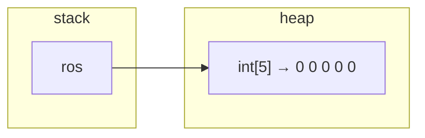

# 7 · Arrays & ArrayList

> 📁 Part 7 of 28 in [Ytube dsa/](README.md) · **Prev:** [06 — Methods](06-Methods_Notes.md) · **Next:** [08 — Linear Search](08-Linear_Search_Notes.md)

## Introduction
An **array** is a fixed-size, numbered row of values of one type, stored in a single block of memory. The lecture motivates it the same way it motivated methods — by showing the version that doesn't scale:

```java
// Q: store 5 roll numbers
int rno1 = 23;
int rno2 = 55;
int rno3 = 18;
// ...and rno4, rno5, and rno100?
```

You cannot loop over `rno1`, `rno2`, `rno3`. You cannot pass them to a method as a group. An array fixes both: one name, one type, indexed access, and a `length` you can loop to.

This is the first note where the data structure **is** the subject — everything from here (searching, sorting, two pointers, matrices) is written against arrays.

## Characteristics of an Array
- **Fixed size:** decided at creation and never changes. `length` is `final`.
- **Homogeneous:** every element is the same declared type.
- **Zero-indexed:** valid indexes are `0` to `length - 1`.
- **Contiguous:** one block of memory, so `arr[i]` is a direct address calculation — **O(1)** access.
- **An object on the heap:** even an array of primitives. The variable holds a reference.

---

## 1. Declaration vs Initialization — Two Separate Steps

```java
int[] ros;              // DECLARATION — the reference variable, on the stack
ros = new int[5];       // INITIALIZATION — the object is created on the heap
```



This is exactly the model from note 01: **the reference lives on the stack, the object lives on the heap**. An array of primitives is still an object — `new` is the giveaway.

The two shorthand forms:

```java
int[] rnos  = new int[5];                    // size known, values defaulted
int[] rnos2 = {23, 12, 45, 32, 15};          // values known, size inferred (5)
```

> 💡 `int[] arr` and `int arr[]` both compile. Prefer `int[] arr` — the type is "array of int", so the brackets belong with the type.

## 2. Default Values

An array is **never** full of garbage — every slot gets its type's default the moment it's created:

```java
int[]     i = new int[3];
boolean[] b = new boolean[2];
double[]  d = new double[2];
String[]  s = new String[2];
char[]    c = new char[2];
```
**Output**
```
[0, 0, 0] [false, false] [0.0, 0.0] [null, null] [0]
```

| Type | Default |
|---|---|
| `int`, `byte`, `short`, `long` | `0` |
| `float`, `double` | `0.0` |
| `boolean` | `false` |
| `char` | `'\u0000'` (prints as `0` when cast to int) |
| any object (`String`, arrays, …) | **`null`** |

That last row is why the lecture's `Main.java` prints `null`:

```java
String[] arr = new String[4];
System.out.println(arr[0]);
```
```
null
```
The array object exists; the four slots are empty references. Calling `arr[0].length()` here would be a `NullPointerException` — **an array of objects starts as an array of nothings.**

## 3. Indexing, `length`, and Going Out of Bounds

```java
int[] arr = new int[5];
arr[0] = 23;
arr[3] = 543;
System.out.println(arr[3]);      // 543
```

`length` is a **field, not a method** — and it is `final`:

```java
arr.length = 5;
```
```
error: cannot assign a value to final variable length
```

Reading past the end is caught at **runtime**, not compile time:

```java
int[] arr = new int[5];
System.out.println(arr[5]);
```
```
Exception in thread "main" java.lang.ArrayIndexOutOfBoundsException: Index 5 out of bounds for length 5
```
Five elements, indexes `0`–`4`. `arr[5]` is the classic off-by-one, and the message tells you both numbers.

> 💡 **Three different ways to ask "how big":** `arr.length` (array, a field) · `str.length()` (String, a method) · `list.size()` (ArrayList, a method). Mixing them up is a compile error every time. Verified: `3 3 1`.

## 4. Reading and Printing

```java
for (int i = 0; i < arr.length; i++) {       // index loop — use when you need i
    arr[i] = in.nextInt();
}

for (int num : arr) {                         // for-each — use when you don't
    System.out.print(num + " ");
}
```

**Printing the array directly does not work:**

```java
int[] arr = {1, 2, 3};
System.out.println(arr);
System.out.println(Arrays.toString(arr));
```
```
[I@24d46ca6
[1, 2, 3]
```

`[I@24d46ca6` is the default `Object.toString()` — `[I` means "array of int", then the identity hash. Arrays do not override `toString()`, so **always use `Arrays.toString(arr)`**. For 2-D you need `deepToString`:

```java
int[][] g = {{1, 2}, {3, 4}};
System.out.println(Arrays.toString(g));
System.out.println(Arrays.deepToString(g));
```
```
[[I@4517d9a3, [I@372f7a8d]
[[1, 2], [3, 4]]
```
`Arrays.toString` on a 2-D array prints the *rows'* addresses, because each row is itself an object.

## 5. Arrays in Methods — Mutation Travels

```java
public class PassinginFunctions {
    public static void main(String[] args) {
        int[] nums = {3, 4, 5, 12};
        System.out.println(Arrays.toString(nums));
        change(nums);
        System.out.println(Arrays.toString(nums));
    }
    static void change(int[] arr) {
        arr[0] = 99;
    }
}
```
**Output**
```
[3, 4, 5, 12]
[99, 4, 5, 12]
```

Exactly the lesson from note 06 §4: Java passes the **reference by value**, so `arr` and `nums` point at the same heap object and the edit is visible to the caller. This is why array-modifying methods can be `void` — they don't need to return anything.

## 6. Finding the Maximum — and a Design Smell

```java
static int max(int[] arr) {
    if (arr.length == 0) {
        return -1;
    }
    int maxVal = arr[0];                 // seed with the first element
    for (int i = 1; i < arr.length; i++) {
        if (arr[i] > maxVal) {
            maxVal = arr[i];
        }
    }
    return maxVal;
}

static int maxRange(int[] arr, int start, int end) {
    if (start > end)  return -1;
    if (arr == null)  return -1;
    int maxVal = arr[start];
    for (int i = start; i <= end; i++) {
        if (arr[i] > maxVal) maxVal = arr[i];
    }
    return maxVal;
}
```
```java
int[] arr = {1, 3, 2, 9, 18};
System.out.println(maxRange(arr, 1, 3));     // elements 3, 2, 9
```
**Output**
```
9
```

This is the **best-so-far** pattern from note 05's `Largest.java`, now over a whole array — and seeding with `arr[0]` rather than `0` is again what makes it correct for all-negative arrays.

> ⚠️ **Worth improving: `-1` as an error code.** Both methods return `-1` to mean "I couldn't answer" — but `-1` is a perfectly valid maximum for `{-5, -1, -9}`. The caller cannot tell an error from a real answer. Better options: throw `IllegalArgumentException`, return `OptionalInt`, or seed with `Integer.MIN_VALUE` and document it. Interviewers notice this; it's the same class of bug as returning `-1` for "not found" when `-1` could be data.

> ⚠️ **Guard order:** `maxRange` tests `start > end` *before* `arr == null`. It happens to be safe (neither line touches `arr`), but the null check belongs first — a null array with valid indexes should never reach `arr[start]`.

## 7. Reversing In Place — the Two-Pointer Pattern

```java
static void reverse(int[] arr) {
    int start = 0;
    int end = arr.length - 1;
    while (start < end) {
        swap(arr, start, end);
        start++;
        end--;
    }
}

static void swap(int[] arr, int index1, int index2) {
    int temp = arr[index1];
    arr[index1] = arr[index2];
    arr[index2] = temp;
}
```
```java
int[] arr = {1, 3, 23, 9, 18, 56};
reverse(arr);
System.out.println(Arrays.toString(arr));
```
**Output**
```
[56, 18, 9, 23, 3, 1]
```

Two pointers walk toward each other, swapping as they go, and stop when they meet. **O(n/2) swaps → O(n) time, O(1) space** — no second array.

> 💡 Note this `swap` *works*, while `swap(int, int)` in note 06 did not. Same name, opposite outcome: there the parameters were copies of values; here the parameter is a reference to the array, and `arr[i] = …` reaches the real object. It is the cleanest illustration of pass-by-value there is.

> 💡 `while (start < end)` — not `<=`. When they meet on the middle element of an odd-length array there is nothing to swap. Using `<=` would swap it with itself: harmless, but one wasted pass.

This is the seed of the **two-pointer** pattern that later powers palindrome checks, container-with-most-water, and 3Sum.

## 8. 2-D Arrays

```java
int[][] arr = new int[3][3];
System.out.println(arr.length);          // number of ROWS
```

- `arr.length` → number of rows
- `arr[row].length` → number of columns **in that row**

```java
for (int row = 0; row < arr.length; row++) {
    for (int col = 0; col < arr[row].length; col++) {
        arr[row][col] = in.nextInt();
    }
}

for (int[] a : arr) {
    System.out.println(Arrays.toString(a));
}
```
**Output** *(entering 1–9)*
```
3
[1, 2, 3]
[4, 5, 6]
[7, 8, 9]
```

**A 2-D array is an array of arrays** — not a rectangle. Each row is a separate object, so rows can have different lengths (**jagged**):

```java
int[][] arr = {
    {1, 2, 3, 4},
    {5, 6},
    {7, 8, 9}
};
```
**Output**
```
1 2 3 4 
5 6 
7 8 9 
```

This is exactly why the inner loop must use `arr[row].length` and not a single fixed width — hard-coding the column count breaks on jagged data.

> ⚠️ **`new int[3][]` leaves the rows null.** Only the outer array is created:
> ```java
> int[][] arr = new int[3][];
> System.out.println(arr[0]);       // null
> System.out.println(arr[0][0]);    // boom
> ```
> ```
> null
> Exception in thread "main" java.lang.NullPointerException: Cannot load from int array because "<local1>[0]" is null
> ```
> You must fill each row yourself (`arr[0] = new int[4];`). `new int[3][3]` builds all four objects for you.

## 9. `ArrayList` — When You Don't Know the Size

An array's size is fixed forever. `ArrayList` grows on demand.

```java
ArrayList<Integer> list = new ArrayList<>();

list.add(67);                 // append
list.get(0);                  // read by index — NOT list[0]
list.set(0, 99);              // overwrite at index
list.remove(2);               // remove BY INDEX (see the trap below)
list.contains(765432);        // search, returns boolean
list.size();                  // how many elements
```

| Operation | Array | ArrayList |
|---|---|---|
| Create | `new int[5]` | `new ArrayList<>()` |
| Read at index | `arr[i]` | `list.get(i)` |
| Write at index | `arr[i] = v` | `list.set(i, v)` |
| Size | `arr.length` | `list.size()` |
| Grow | impossible | `list.add(v)` |
| Holds primitives? | yes (`int[]`) | no — `ArrayList<Integer>` (boxed) |
| Print | `Arrays.toString(arr)` | `System.out.println(list)` |

`<Integer>` is a **generic** — it tells the compiler what the list holds, so `list.get(0)` is already an `Integer` with no cast. You cannot write `ArrayList<int>`; primitives get their wrapper types (`Integer`, `Double`, `Character`, `Boolean`).

> ⚠️ **`new ArrayList<>(5)` does not create five slots.** The lecture code writes exactly this, which reads like `new int[5]` but means something completely different — it is the **initial capacity**, an internal buffer hint. The list is still **empty**:
> ```java
> ArrayList<Integer> l = new ArrayList<>(5);
> System.out.println(l.size());   // 0
> System.out.println(l.get(0));   // boom
> ```
> ```
> size after new ArrayList<>(5) = 0
> Exception in thread "main" java.lang.IndexOutOfBoundsException: Index 0 out of bounds for length 0
> ```
> Capacity is about *when the internal array is resized*; size is *how many elements exist*. You still have to `add()` before there is anything to `get()`.

> ⚠️ **`remove(2)` removes the element at index 2 — not the value 2.** With `ArrayList<Integer>` there are two `remove` methods and Java picks the `int` (index) one:
> ```java
> ArrayList<Integer> l = new ArrayList<>(List.of(10, 20, 30, 40));
> l.remove(2);                          // index 2
> ArrayList<Integer> m = new ArrayList<>(List.of(10, 20, 30, 40));
> m.remove(Integer.valueOf(20));        // the VALUE 20
> ```
> ```
> after remove(2)            -> [10, 20, 40]
> after remove(Integer(20))  -> [10, 30, 40]
> ```
> Exact match beats boxing (note 06 §7), so `remove(int)` wins. To remove by value, box it explicitly.

**How it grows:** an `ArrayList` is an array inside. When it fills, it allocates a bigger one (~1.5×) and copies everything over. That copy is O(n), but it happens rarely enough that `add` is **O(1) amortised**.

## 10. 2-D `ArrayList`

```java
ArrayList<ArrayList<Integer>> list = new ArrayList<>();

for (int i = 0; i < 3; i++) {
    list.add(new ArrayList<>());          // each row must be created explicitly
}
for (int i = 0; i < 3; i++) {
    for (int j = 0; j < 3; j++) {
        list.get(i).add(in.nextInt());
    }
}
System.out.println(list);
```
**Output** *(entering 1–9)*
```
[[1, 2, 3], [4, 5, 6], [7, 8, 9]]
```

Same lesson as `new int[3][]`: the outer list does not build the inner ones. And unlike arrays, `System.out.println(list)` prints properly at any depth — collections override `toString()`.

## 11. Comparing Arrays

```java
int[] x = {1, 2, 3};
int[] y = {1, 2, 3};
System.out.println(x == y);
System.out.println(x.equals(y));
System.out.println(Arrays.equals(x, y));
```
**Output**
```
x==y        : false
x.equals(y) : false
Arrays.equals: true
```

`==` compares references (note 05). And **`.equals()` on an array is no better** — arrays don't override it, so it falls back to `Object.equals`, which is `==`. Use **`Arrays.equals`** for contents, **`Arrays.deepEquals`** for 2-D.

## 12. One Sharp Edge: Array Covariance

```java
Object[] o = new String[2];
o[0] = "ok";      // fine
o[1] = 42;        // compiles — fails at runtime
```
```
stored a String fine
Exception in thread "main" java.lang.ArrayStoreException: java.lang.Integer
```

Java lets you treat a `String[]` as an `Object[]` (arrays are **covariant**), so the compiler accepts storing an `Integer` — but the object really is a `String[]` and throws at runtime. Generics were designed to *not* have this hole, which is why `List<String>` is **not** a `List<Object>`. Rare in practice, but it explains a design decision you'll meet again.

---

## ⚠️ Common Misunderstandings
**1. `System.out.println(arr)` prints the elements.**
❌ `[1, 2, 3]` · ✅ `[I@24d46ca6`. Use `Arrays.toString(arr)`, or `Arrays.deepToString` for 2-D.

**2. `arr.length()` / `str.length` / `list.length`.**
❌ mixed up · ✅ `arr.length` (field) · `str.length()` (method) · `list.size()` (method).

**3. An array's size can be changed.**
❌ `arr.length = 5` · ✅ `error: cannot assign a value to final variable length`. Create a new array or use `ArrayList`.

**4. Valid indexes run to `length`.**
❌ `arr[arr.length]` · ✅ last index is `length - 1`; otherwise `ArrayIndexOutOfBoundsException: Index 5 out of bounds for length 5`.

**5. `new String[4]` gives four empty strings.**
❌ `""` · ✅ four `null`s. Any method call on them is a `NullPointerException`.

**6. `new int[3][]` gives a 3×something grid.**
❌ ready to use · ✅ rows are `null` until you assign them — `NullPointerException` on `arr[0][0]`.

**7. Every row of a 2-D array is the same length.**
❌ always rectangular · ✅ rows are separate objects and may be jagged. Loop with `arr[row].length`.

**8. `new ArrayList<>(5)` creates 5 elements.**
❌ like `new int[5]` · ✅ that's **capacity**; `size()` is `0` and `get(0)` throws.

**9. `list.remove(2)` removes the value 2.**
❌ by value · ✅ by **index**. Use `list.remove(Integer.valueOf(2))` for the value.

**10. `arr1.equals(arr2)` compares contents.**
❌ compares contents · ✅ it's reference equality. Use `Arrays.equals` / `Arrays.deepEquals`.

**11. `ArrayList<int>`.**
❌ primitives allowed · ✅ generics need object types: `ArrayList<Integer>`.

**12. Passing an array to a method copies it.**
❌ a copy · ✅ the reference is copied, so edits inside the method are visible outside (`[99, 4, 5, 12]`).

## JavaScript Comparison
| | Java | JavaScript |
|---|---|---|
| Closest thing to a JS array | **`ArrayList`**, not `int[]` | `[]` — dynamic by default |
| Size | fixed (`int[]`) or `size()` (`ArrayList`) | `arr.length`, and **assignable** (`arr.length = 0` empties it) |
| Mixed types | no — one declared type | yes — `[1, "a", {}]` |
| Out-of-range read | `ArrayIndexOutOfBoundsException` | `undefined`, silently |
| Append | `list.add(v)` | `arr.push(v)` |
| Read | `arr[i]` / `list.get(i)` | `arr[i]` for both |
| Printing | `Arrays.toString(arr)` | `console.log(arr)` just works |
| Equality by content | `Arrays.equals(a, b)` | `JSON.stringify(a) === JSON.stringify(b)` or a loop |
| 2-D | `int[][]`, rows may be jagged | array of arrays, same |
| Holds primitives efficiently | `int[]` — no boxing | no — all numbers are doubles |

> 💡 The mental swap to make: **Java's `ArrayList` is what you think of as "an array"; Java's `int[]` is the lower-level thing JS never exposes.** Use `int[]` when the size is known and you want speed (most DSA problems hand you one); use `ArrayList` when the size grows as you go.

## Interview Angles
- **"Array vs ArrayList?"** — Fixed vs growable; primitives vs boxed objects; `length` vs `size()`; `arr[i]` vs `get(i)`. Both are O(1) random access because an ArrayList *is* an array inside.
- **"Is `add` really O(1)?"** — **Amortised** O(1). When full it allocates a larger array and copies (O(n)), but rarely enough that the average stays constant.
- **"Reverse an array in place."** — Two pointers, `while (start < end)`, swap and step inward. O(n) time, O(1) space. Say the `<` vs `<=` reasoning out loud.
- **"Find the maximum."** — Seed with `arr[0]`, never `0`, or negatives break it. Then: what do you return for an empty array? (Not `-1`.)
- **"How do you compare two arrays?"** — `Arrays.equals`, because `==` and `.equals` are both reference equality.
- **"Why does `list.remove(2)` do something surprising?"** — Two overloads; exact `int` match beats boxing, so index wins.
- **Complexity to have ready:** access `O(1)`, search `O(n)`, insert/delete in the middle `O(n)` (shifting), append to `ArrayList` `O(1)` amortised.

## Related · Next
- **Related:** [[Methods]] (06 — pass-by-value, which §5 and §7 depend on) · [[Introduction to Programming]] (01 — stack/heap) · [[Arrays]] (1.2) · [[Matrix]] (1.3) · [[Two Pointers]] (3.1 — §7 is its first appearance)
- **Practice:** write `sum(int[])`, `contains(int[], int)`, and `secondMax(int[])` — each a best-so-far or single-pass loop. Then rewrite `reverse` to return a **new** array instead of mutating, and note which version a caller would prefer.
- **Next:** `08` — Linear Search (bootcamp lecture 09)

---

## 🔁 Rapid Revision (self-test)
Answer out loud **before** expanding.

<details><summary>1. What do `int[] ros;` and `ros = new int[5];` each do?</summary>

The first creates the reference variable on the **stack**; the second creates the array **object on the heap** and points the reference at it. Arrays are objects, even arrays of primitives.
</details>

<details><summary>2. What is in `new int[3]` and `new String[2]` right after creation?</summary>

`[0, 0, 0]` and `[null, null]`. Numbers default to 0, `boolean` to `false`, `char` to `'\u0000'`, and every object type to `null`.
</details>

<details><summary>3. Why does `System.out.println(arr)` print `[I@24d46ca6`?</summary>

Arrays don't override `toString()`, so you get `Object.toString()` — `[I` (array of int) plus an identity hash. Use `Arrays.toString`, or `Arrays.deepToString` for 2-D.
</details>

<details><summary>4. Three ways to ask "how big", and which belongs to what?</summary>

`arr.length` (array — a **field**, and `final`), `str.length()` (String — a method), `list.size()` (ArrayList — a method).
</details>

<details><summary>5. Why does `change(int[] arr) { arr[0] = 99; }` affect the caller?</summary>

The reference is copied, but it still points at the same heap array, so indexing reaches the real object. Re-pointing the parameter (`arr = new int[…]`) would *not* be visible.
</details>

<details><summary>6. Why seed `max` with `arr[0]` instead of `0`? And what's wrong with returning `-1`?</summary>

Seeding with `0` breaks for all-negative arrays. Returning `-1` for errors is ambiguous, since `-1` can be a legitimate maximum — throw, or return `OptionalInt`.
</details>

<details><summary>7. How does in-place reverse work, and why `while (start < end)`?</summary>

Two pointers from both ends, swapping and stepping inward. O(n) time, O(1) space. With `<=`, the middle element of an odd-length array would be swapped with itself — a wasted pass.
</details>

<details><summary>8. What is a 2-D array really, and why use `arr[row].length`?</summary>

An array **of arrays** — each row a separate object that can have its own length (jagged). A fixed column count breaks on jagged data.
</details>

<details><summary>9. What's the difference between `new int[3][3]` and `new int[3][]`?</summary>

The first creates the outer array *and* all three rows. The second creates only the outer array — every row is `null` until assigned, so `arr[0][0]` throws `NullPointerException`.
</details>

<details><summary>10. What does `new ArrayList<>(5)` actually give you?</summary>

An **empty** list with an initial capacity hint of 5. `size()` is `0`, and `get(0)` throws `IndexOutOfBoundsException`. Capacity ≠ size.
</details>

<details><summary>11. `list.remove(2)` on `[10, 20, 30, 40]` — result, and why?</summary>

`[10, 20, 40]` — it removed **index** 2. Exact `int` match beats boxing, so `remove(int)` is chosen. For the value, use `remove(Integer.valueOf(2))`.
</details>

<details><summary>12. How do you compare two arrays by content?</summary>

`Arrays.equals(x, y)` (or `deepEquals` for 2-D). Both `==` and `.equals()` are reference comparisons and return `false` for equal-looking arrays.
</details>

<details><summary>13. Is ArrayList's `add` O(1)?</summary>

**Amortised** O(1). It's an array inside; when it fills it allocates a larger one and copies (O(n)), but rarely enough that the average stays constant.
</details>
