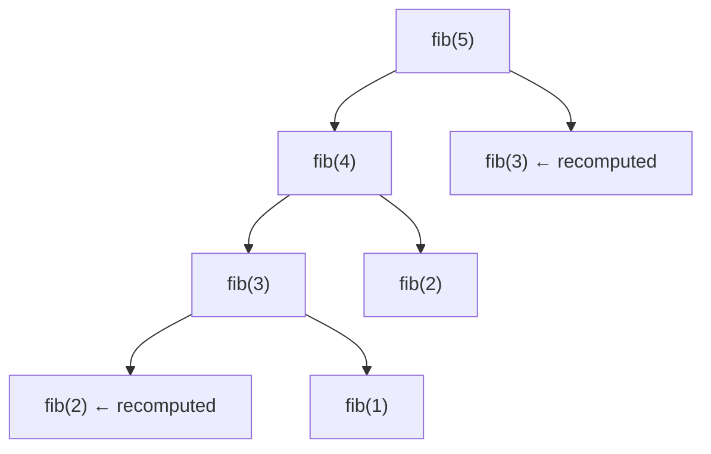

# 14 · Recursion I — Basics

> 📁 Part 14 of 28 in [Ytube dsa/](README.md) · **Prev:** [13 — Complexity Analysis](13-Complexity_Notes.md) · **Next:** [15 — Recursion II](15-Recursion_Subsets_Notes.md)

## Introduction
**Recursion is a method calling itself.** That's the mechanic. The mental model is what's hard, and it's the one thing note 06 already built: **every call gets its own stack frame with its own copy of the parameters and locals.** A method calling itself isn't magic — it just pushes another frame.

The lecture opens with the joke version, and it's genuinely the right starting point:

```java
static void message()  { System.out.println("Hello World"); message1(); }
static void message1() { System.out.println("Hello World"); message2(); }
static void message2() { System.out.println("Hello World"); message3(); }
static void message3() { System.out.println("Hello World"); message4(); }
static void message4() { System.out.println("Hello World"); }
```
**Output**
```
Hello World
Hello World
Hello World
Hello World
Hello World
```

Five near-identical methods. Recursion collapses them into one — but note what `message4` does: **it doesn't call anything.** That's the base case, and it's the only reason this terminates.

## Characteristics
- **Two required parts:** a base case (stop) and a recursive case (shrink toward the base).
- **Each call is independent:** its own frame, its own parameters, its own locals.
- **Costs stack space:** O(depth) — and overflows at ~19,700 frames.
- **Anything recursive can be written iteratively** (and vice versa) — the choice is about clarity.

---

## 1. The Two Rules

```java
static void print(int n) {
    if (n == 5) {              // 1. BASE CASE — stop
        System.out.println(5);
        return;
    }
    System.out.println(n);
    print(n + 1);              // 2. RECURSIVE CASE — move TOWARD the base
}
```
```java
print(1);
```
**Output**
```
1
2
3
4
5
```

**Every recursive method needs both.** Miss the base case and you recurse forever (`StackOverflowError`). Have a base case that the recursive call never approaches, and you get the same result.

> 💡 **The test:** does every recursive call move the argument strictly closer to the base case? `print(n + 1)` with base `n == 5` works from `n ≤ 5`. From `n = 6` it never terminates — the base must be reachable *from your actual inputs*. `n >= 5` would be the safer guard.

## 2. Factorial and Sum — Recursion That Returns

```java
static int fact(int n) {
    if (n <= 1) return 1;
    return n * fact(n - 1);
}

static int sum(int n) {
    if (n <= 1) return 1;
    return n + sum(n - 1);
}
```
```java
System.out.println(fact(5));
System.out.println(sum(5));
```
**Output**
```
120
15
```

**Trace `fact(5)`** — the calls stack up, then unwind:

```
fact(5) -> 5 * fact(4)          push
           fact(4) -> 4 * fact(3)      push
                      fact(3) -> 3 * fact(2)      push
                                 fact(2) -> 2 * fact(1)     push
                                            fact(1) -> 1    BASE, pop
                                 fact(2) = 2 * 1  = 2       pop
                      fact(3) = 3 * 2  = 6                  pop
           fact(4) = 4 * 6  = 24                            pop
fact(5) = 5 * 24 = 120                                      pop
```

The multiplication happens **on the way back up**. Nothing is computed until the base case is reached — the frames just accumulate. Drawing this trace is the single best way to debug recursion.

> 💡 `n <= 1` rather than `n == 1` guards against `fact(0)` (correctly 1) and prevents infinite recursion on negatives. Use `<=` for base cases; `==` is fragile.

## 3. Tail Recursion

```java
print(n + 1);          // tail: nothing happens after the call
return n * fact(n-1);  // NOT tail: the multiplication waits for the result
```

A call is **tail recursive** when it is the *last* thing the method does — no pending work after it returns. Tail calls can in principle be optimised into a loop, reusing one frame.

> ⚠️ **Java does not do tail-call optimisation.** Scala, Kotlin (`tailrec`) and most functional languages do; the JVM does not. So in Java, tail recursion still consumes a frame per call and still overflows. The distinction is worth knowing for interviews and for reading other languages — but it buys you nothing here.

## 4. Passing State Down vs Returning It Up

Two shapes, and knowing which to use is most of the skill.

**Return it up** (the `fact` style) — each call computes from its child's result:
```java
return n + sum(n - 1);
```

**Pass it down** (an accumulator) — carry the running answer in a parameter:
```java
static int count(int n) {
    return helper(n, 0);                    // seed the accumulator
}

private static int helper(int n, int c) {
    if (n == 0) return c;                   // base returns the accumulated value
    int rem = n % 10;
    if (rem == 0) return helper(n / 10, c + 1);
    return helper(n / 10, c);
}
```
```java
System.out.println(count(30210004));
```
**Output**
```
4
```

> 💡 **The helper-method pattern.** When recursion needs extra state the public signature shouldn't expose, write a small public method that seeds it and delegates to a private helper. The lecture uses this for counting zeros, reversing digits, and counting steps. You'll use it constantly — the public API stays clean, and the recursion gets the parameters it needs.

## 5. Digits, Reversal and Palindrome — Recursion Meets Note 05

The same `% 10` / `/ 10` peel from note 05, now recursive:

```java
static int rev(int n) {
    int digits = (int)(Math.log10(n)) + 1;
    return helper(n, digits);
}

private static int helper(int n, int digits) {
    if (n % 10 == n) return n;                    // single digit left
    int rem = n % 10;
    return rem * (int)(Math.pow(10, digits - 1)) + helper(n / 10, digits - 1);
}

static boolean palin(int n) {
    return n == rev(n);
}
```
```java
System.out.println(rev(1234));
System.out.println(palin(1));
```
**Output**
```
4321
true
```

Note the base case `n % 10 == n` — an idiomatic way to say "n has one digit", since for any single digit `n % 10` is `n` itself.

> ⚠️ This reversal depends on `Math.log10(n)` to count digits, which (as note 08 showed) misbehaves for `n = 0`. The iterative version in note 05 has no such dependency. Recursive isn't automatically better — here the loop is genuinely cleaner.

## 6. The Cost — Measured

```java
static int fibo(int n) {
    if (n < 2) return n;
    return fibo(n - 1) + fibo(n - 2);
}
```
**Measured on JDK 21:**
```
naive fib(10) = 55         calls=177          time=     0 ms
naive fib(20) = 6765       calls=21891        time=     0 ms
naive fib(30) = 832040     calls=2692537      time=     6 ms
naive fib(35) = 9227465    calls=29860703     time=    61 ms
naive fib(40) = 102334155  calls=331160281    time=   677 ms
iterative fib(40) = 102334155  time=0 ms
```

**331 million calls** to compute the 40th Fibonacci number, versus 40 iterations. The recurrence `T(n) = T(n-1) + T(n-2)` is **O(2ⁿ)** (note 13 §7).

Why so bad? `fib(5)` calls `fib(4)` and `fib(3)`; `fib(4)` calls `fib(3)` again. The same subproblems are recomputed exponentially many times.



**The fix — memoization:** cache each result the first time it's computed.

```java
static long fiboMemo(int n, long[] memo) {
    if (n < 2) return n;
    if (memo[n] != 0) return memo[n];          // already known
    return memo[n] = fiboMemo(n-1, memo) + fiboMemo(n-2, memo);
}
```
Each value is computed once → **O(n) time, O(n) space**. This one change — *remember what you already solved* — is the entire idea behind **dynamic programming**.

## 7. The Hard Limit

```
StackOverflowError caught at depth ~19754
```

Roughly 19,700 frames on a default JVM stack. So:

- Recursion of depth n costs **O(n) space** and has a ceiling
- An iterative loop of the same depth costs **O(1)** and has none
- Recursion on a **balanced tree** is fine (depth ~log n → ~20 frames for a million nodes)
- Recursion over a **linked list of a million nodes** will overflow

> 💡 `StackOverflowError` is an `Error`, not an `Exception` — you're not meant to catch it in real code. Seeing it almost always means a missing or unreachable base case.

## 8. Recursion vs Iteration

| | Recursion | Iteration |
|---|---|---|
| Space | O(depth) stack | O(1) |
| Speed | slower (call overhead) | faster |
| Depth limit | ~19,700 frames | none |
| Clarity for trees/graphs | **much better** | awkward (manual stack) |
| Clarity for linear scans | worse | **better** |

**Use recursion when the problem is recursively shaped** — trees, graphs, divide-and-conquer, backtracking. For counting digits or summing an array, the loop is clearer *and* cheaper.

Binary search is a fair example of both being reasonable:
```java
static int bs(int[] arr, int target, int start, int end) {
    if (start > end) return -1;                  // base case
    int mid = start + (end - start) / 2;
    if (arr[mid] == target) return mid;
    if (target < arr[mid]) return bs(arr, target, start, mid - 1);
    return bs(arr, target, mid + 1, end);
}
```
Same O(log n) time; the recursive version adds O(log n) stack space — about 20 frames for a million elements, which is nothing. Either is fine here.

---

## ⚠️ Common Misunderstandings
**1. Recursion needs only a base case.**
❌ just a base · ✅ it needs a base case **and** every recursive call must move toward it. `print(n+1)` with base `n == 5` never terminates from `n = 6`.

**2. `n == 1` is a fine base case for factorial.**
❌ fine · ✅ use `n <= 1` — it handles `0` and stops negatives recursing forever.

**3. The work happens on the way down.**
❌ going down · ✅ for `return n * fact(n-1)`, the multiplication happens **on the way back up**, after the base case returns.

**4. Java optimises tail recursion.**
❌ it does · ✅ **it does not.** Tail calls still consume a frame and still overflow. Kotlin/Scala do; the JVM doesn't.

**5. Recursion is free.**
❌ free · ✅ O(depth) stack space, plus per-call overhead. `StackOverflowError` at ~19,700 frames.

**6. Naive Fibonacci is just "a bit slower".**
❌ a bit · ✅ **331 million calls for n = 40** vs 40 iterations. O(2ⁿ).

**7. Recursion is always more elegant.**
❌ always · ✅ for linear work a loop is clearer and cheaper. Recursion wins for recursively-shaped data: trees, graphs, divide-and-conquer.

**8. You can't carry state through recursion without globals.**
❌ need a global · ✅ pass an **accumulator parameter** via a private helper. (The lecture's `Reverse.rev1` does use a `static` field — avoid that: it breaks on a second call, since the field keeps its old value.)

## JavaScript Comparison
| | Java | JavaScript |
|---|---|---|
| Syntax | identical shape | identical shape |
| Tail-call optimisation | ❌ never | spec'd in ES6, only Safari implements it |
| Stack depth | ~19,700 | ~10,000 typically |
| Overflow signal | `StackOverflowError` | `RangeError: Maximum call stack size exceeded` |
| Memo structure | `long[]` or `HashMap` | object or `Map` |

> 💡 Both languages hit the same wall for the same reason. Neither can be relied on for deep linear recursion — convert to a loop or an explicit stack.

## Interview Angles
- **"Explain recursion."** — A method that calls itself, with a base case and a recursive case that moves toward it. Each call gets its own stack frame. Mention O(depth) space unprompted.
- **"Why is naive Fibonacci slow, and how would you fix it?"** — Overlapping subproblems, O(2ⁿ); memoise → O(n). **This is the standard on-ramp to dynamic programming.**
- **"Recursion vs iteration?"** — Same results; recursion costs stack space but is far clearer for tree/graph/divide-and-conquer shapes.
- **"When would recursion break?"** — Deep linear structures. A balanced tree of a million nodes is ~20 frames; a linked list of a million is an overflow.
- **"Convert this recursion to iteration."** — Common follow-up. Tail recursion → a straight loop; non-tail → an explicit `Stack`.
- **Trace it out loud.** When stuck, say "let me trace `fact(3)`" and walk the frames. Interviewers want to see the stack model, not a memorised answer.

## Related · Next
- **Related:** [[Methods]] (06 — stack frames) · [[Complexity Analysis]] (13 — recurrences) · [[Recursion]] (2.1) · [[Binary Search]] (09)
- **Practice:** write `sumOfDigits`, `power(base, exp)`, `countZeros` and recursive `binarySearch` — each with an explicit base case. Then memoise Fibonacci and measure the difference yourself.
- **Next:** [15 — Recursion II: Subsets, Strings & Permutations](15-Recursion_Subsets_Notes.md)

---

## 🔁 Rapid Revision (self-test)
<details><summary>1. The two required parts of any recursive method?</summary>

A **base case** that stops, and a **recursive case** that moves strictly toward it. Missing or unreachable either one gives `StackOverflowError`.
</details>

<details><summary>2. In `fact(5)`, when does the multiplication happen?</summary>

On the way **back up**. The calls stack to `fact(1)`, then multiply as frames pop: 1 → 2 → 6 → 24 → 120.
</details>

<details><summary>3. Why `n <= 1` instead of `n == 1`?</summary>

It handles `fact(0)` correctly and stops negative inputs recursing forever. `==` bases are fragile.
</details>

<details><summary>4. What is tail recursion, and does Java optimise it?</summary>

A recursive call that is the last action, with no pending work. **Java does not optimise it** — the frame is still consumed. Kotlin and Scala do.
</details>

<details><summary>5. Two ways to carry state through recursion?</summary>

Return it up (`return n + sum(n-1)`), or pass it down as an **accumulator** parameter via a private helper. Avoid static fields — they persist between calls.
</details>

<details><summary>6. Why is naive Fibonacci O(2ⁿ), and what are the real numbers?</summary>

`T(n) = T(n-1) + T(n-2)` — overlapping subproblems recomputed exponentially. Measured: **331,160,281 calls for fib(40)**, 677 ms, vs 0 ms iteratively.
</details>

<details><summary>7. What does memoization change?</summary>

Each value is computed once and cached: O(2ⁿ) → **O(n) time, O(n) space**. It's the core idea of dynamic programming.
</details>

<details><summary>8. What's the practical depth limit, and when does it bite?</summary>

~19,700 frames. Fine for balanced trees (depth ~log n), fatal for deep linear structures like a million-node linked list.
</details>

<details><summary>9. When should you prefer recursion over a loop?</summary>

When the data is recursively shaped — trees, graphs, divide-and-conquer, backtracking. For linear scans, a loop is clearer and cheaper.
</details>
