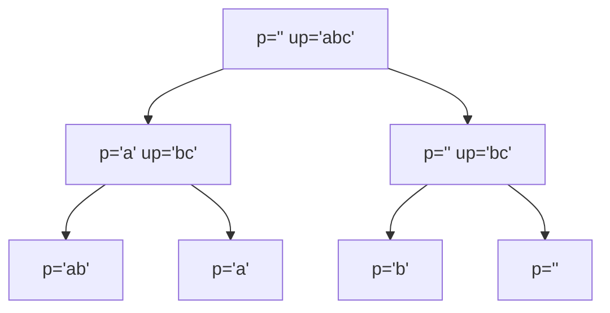

# 15 · Recursion II — Subsets, Strings & Permutations

> 📁 Part 15 of 28 in [Ytube dsa/](README.md) · **Prev:** [14 — Recursion I](14-Recursion_Basics_Notes.md) · **Next:** [16 — Recursion III](16-Recursion_Sorting_Backtracking_Notes.md)

## Introduction
Note 14 used recursion to compute **one value**. This note uses it to generate **every possibility** — all subsets, all permutations, every way to reach a target. These are the problems where recursion isn't just convenient, it's the only sane approach.

There is one pattern underneath almost all of them, and once you see it the rest are variations:

> **Carry two strings: `p` (processed) and `up` (unprocessed). At each call, take the first character off `up`, decide what to do with it, and recurse on the rest. When `up` is empty, `p` is a complete answer.**

## Characteristics
- **Exponential by nature:** you are *producing* 2ⁿ or n! things, so the output size is the complexity.
- **Two shapes:** print-as-you-go (`void`) or return-a-list (`ArrayList`). Same recursion, different plumbing.
- **The base case builds the answer:** when `up` is empty, `p` is finished.
- **The number of recursive calls per level decides the shape:** 2 → subsets, k → k-ary, "position anywhere" → permutations.

---

## 1. Subsequences — Take It or Leave It

Every character has exactly two fates: **include** it or **skip** it.

```java
static void subseq(String p, String up) {
    if (up.isEmpty()) {
        System.out.println(p);
        return;
    }
    char ch = up.charAt(0);
    subseq(p + ch, up.substring(1));    // TAKE the character
    subseq(p, up.substring(1));         // SKIP the character
}
```

Two calls per level, n levels → **2ⁿ** results. For `"abc"`: `abc, ab, ac, a, bc, b, c, ""`.



**The return-a-list version** — same recursion, but each call hands its results upward:

```java
static ArrayList<String> subseqRet(String p, String up) {
    if (up.isEmpty()) {
        ArrayList<String> list = new ArrayList<>();
        list.add(p);
        return list;                    // base case returns a ONE-element list
    }
    char ch = up.charAt(0);
    ArrayList<String> left  = subseqRet(p + ch, up.substring(1));
    ArrayList<String> right = subseqRet(p, up.substring(1));
    left.addAll(right);                 // combine both branches
    return left;
}
```

> 💡 **This pairing is the whole lesson of the section.** Printing is easier to write; returning is what real problems need (LeetCode wants a `List<List<Integer>>`, not console output). The recursion is identical — only the base case and the combining step change. Learn to convert between them fluently.

**A third variant adds a third branch** — append the character's ASCII code as well:
```java
subseqAscii(p + ch, up.substring(1));
subseqAscii(p, up.substring(1));
subseqAscii(p + (ch + 0), up.substring(1));    // ch+0 is an int -> appends "97"
```
```
[abc, ab, ab99, ac, a, a99, a98c, a98, a9899, bc, b, b99, c, , 99, 98c, 98, 9899, 97bc, 97b, 97b99, 97c, 97, 9799, 9798c, 9798, 979899]
```
**3ⁿ = 27** results for a 3-character input. `ch + 0` promotes the `char` to `int` (note 04 §11), so `+` appends the number `97` rather than the letter `a` — the `'a' + 'b' = 195` rule from note 11, used deliberately. **More branches per level = a bigger base in the exponent.**

## 2. Subsets — the Iterative Version

The same 2ⁿ result set, built without recursion:

```java
static List<List<Integer>> subset(int[] arr) {
    List<List<Integer>> outer = new ArrayList<>();
    outer.add(new ArrayList<>());              // start with the empty subset
    for (int num : arr) {
        int n = outer.size();
        for (int i = 0; i < n; i++) {
            List<Integer> internal = new ArrayList<>(outer.get(i));   // COPY
            internal.add(num);
            outer.add(internal);
        }
    }
    return outer;
}
```

For each new number, **duplicate every existing subset and add the number to the copy** — the list doubles each pass: 1 → 2 → 4 → 8. Note `int n = outer.size()` is captured *before* the inner loop; without it you'd iterate over the entries you're adding, forever.

**Handling duplicates** — sort first, then only extend the subsets created in the *previous* round:

```java
static List<List<Integer>> subsetDuplicate(int[] arr) {
    Arrays.sort(arr);                     // equal values must be adjacent
    ...
    if (i > 0 && arr[i] == arr[i - 1]) {
        start = end + 1;                  // skip the older subsets
    }
    end = outer.size() - 1;
    ...
}
```
```java
int[] arr = {1, 2, 2};
```
**Output**
```
[]
[1]
[2]
[1, 2]
[2, 2]
[1, 2, 2]
```

Six subsets, not eight — `[2]` and `[1,2]` each appear once. The `start = end + 1` window is what prevents generating them twice. Sorting first is essential: the rule only works when equal values are adjacent.

## 3. Permutations — Insert Into Every Position

A permutation uses **every** character, so nothing is skipped. Instead, insert the new character at **every position** of what's built so far.

```java
static void permutations(String p, String up) {
    if (up.isEmpty()) {
        System.out.println(p);
        return;
    }
    char ch = up.charAt(0);
    for (int i = 0; i <= p.length(); i++) {          // <= : n+1 gaps for n chars
        String f = p.substring(0, i);
        String s = p.substring(i, p.length());
        permutations(f + ch + s, up.substring(1));   // splice ch into position i
    }
}
```
```java
System.out.println(permutationsCount("", "abcd"));
```
**Output**
```
24
```

**4! = 24.** ✓ At each level, a string of length `k` has `k + 1` insertion gaps, so the branching grows: 1 × 2 × 3 × 4 = 24. That's why `i <= p.length()` uses `<=` — `"ab"` has three gaps (`_a_b_`), not two.

**Three return shapes, one recursion:**

| Variant | Base case returns | Combines with |
|---|---|---|
| `permutations` | prints, returns void | — |
| `permutationsList` | a one-element list | `ans.addAll(...)` |
| `permutationsCount` | `1` | `count += ...` |

Counting without building is a genuinely useful trick: it's **O(1) space** beyond the stack, where collecting all 24 strings is O(n!·n).

## 4. Dice — Variable Branching Toward a Target

"In how many ways can dice rolls sum to a target?"

```java
static void dice(String p, int target) {
    if (target == 0) {
        System.out.println(p);
        return;
    }
    for (int i = 1; i <= 6 && i <= target; i++) {     // <= target: don't overshoot
        dice(p + i, target - i);
    }
}
```
```java
dice("", 4);
```
**Output**
```
1111
112
121
13
211
22
31
4
```

Eight ways to make 4. The loop bound `i <= 6 && i <= target` does two jobs: dice only go to 6, and **overshooting is pruned before it happens**. Without `i <= target` you'd recurse into negative targets that can never hit the base case — a wasted subtree, and with `target == 0` as the base, an infinite one.

> 💡 This is **pruning**: killing a branch as soon as it cannot lead to an answer. It's the core idea of backtracking, arriving properly in note 16.

Generalising the face count is a one-parameter change (`diceFace(p, target, face)`) — a good example of designing the signature for the general case from the start.

## 5. Phone Pad — Mapping Digits to Letters

```java
static void pad(String p, String up) {
    if (up.isEmpty()) { System.out.println(p); return; }
    int digit = up.charAt(0) - '0';                    // '2' -> 2
    for (int i = (digit - 1) * 3; i < digit * 3; i++) {
        char ch = (char)('a' + i);
        pad(p + ch, up.substring(1));
    }
}
```
```java
System.out.println(padRet("", "12").size());
```
**Output**
```
9
```

Three letters per digit, two digits → **3 × 3 = 9**. Two `char` tricks from note 11 doing real work:

- **`up.charAt(0) - '0'`** converts the character `'2'` to the number `2` (50 − 48). The standard idiom for digit parsing.
- **`(char)('a' + i)`** maps an index back to a letter.

## 6. Complexity — Why It's Exponential

| Problem | Results | Time | Space (excl. output) |
|---|---|---|---|
| Subsequences / subsets | 2ⁿ | **O(2ⁿ · n)** | O(n) stack |
| Subsequences with 3 branches | 3ⁿ | O(3ⁿ · n) | O(n) stack |
| Permutations | n! | **O(n! · n)** | O(n) stack |
| Dice to target t | ~6ᵗ bounded | O(6ᵗ) | O(t) stack |
| Phone pad, d digits | 3ᵈ–4ᵈ | O(4ᵈ · d) | O(d) stack |

The extra `· n` is the cost of building each result string. **This is not inefficiency** — if a problem asks for all n! permutations, producing them *is* n! work. The complexity is the output size.

What you *can* control is **pruning** (don't explore branches that can't work — the `i <= target` guard) and **not building what you don't need** (`permutationsCount` returns a number, never a list).

> ⚠️ **`substring` is not free.** Every `up.substring(1)` allocates a new String — O(n) each. That's the hidden `· n` factor. Production versions pass an **index** into the original string instead of slicing it, or use a `StringBuilder` with undo (note 16's backtracking).

---

## ⚠️ Common Misunderstandings
**1. Recursion here works differently from note 14.**
❌ different · ✅ identical mechanics — base case, recursive case, stack frames. Only the *number of calls per level* changes.

**2. `i < p.length()` is right for permutations.**
❌ `<` · ✅ **`<=`** — a string of length k has k+1 insertion gaps. `<` silently loses permutations.

**3. Printing and returning are different algorithms.**
❌ different · ✅ same recursion. Base returns a one-element list instead of printing; branches combine with `addAll`.

**4. The duplicate-subset fix works without sorting.**
❌ works · ✅ `Arrays.sort` first is essential — the `start = end + 1` window assumes equal values are adjacent.

**5. `int n = outer.size()` inside the loop is fine.**
❌ fine · ✅ capture the size **before** the inner loop, or you iterate over entries you're adding — an infinite loop.

**6. `i <= 6` is enough for the dice loop.**
❌ enough · ✅ you also need `i <= target`, or you recurse into negative targets that never reach `target == 0`.

**7. Exponential complexity means the code is bad.**
❌ bad · ✅ producing 2ⁿ results *is* 2ⁿ work. Optimise by pruning, or by counting instead of collecting.

**8. `substring` is free.**
❌ free · ✅ it allocates a new String every call — the hidden `· n`. Pass an index instead when it matters.

## JavaScript Comparison
| | Java | JavaScript |
|---|---|---|
| Slice a string | `up.substring(1)` | `up.slice(1)` |
| Char → digit | `ch - '0'` | `+ch` or `ch.charCodeAt(0) - 48` |
| Index → letter | `(char)('a' + i)` | `String.fromCharCode(97 + i)` |
| Collect results | `ArrayList<String>`, `addAll` | array, `push` / spread |
| Return a nested list | `List<List<Integer>>` | array of arrays |

> 💡 The algorithms are identical; JS just has lighter syntax for slicing and spreading. The `char` arithmetic is the one place Java is more explicit — and, once learned, clearer about what's actually happening.

## Interview Angles
- **"Generate all subsets."** (LeetCode 78) — Take-it-or-leave-it recursion, or the iterative doubling. 2ⁿ, and say so.
- **"Subsets with duplicates."** (90) — Sort, then only extend the previous round's subsets.
- **"All permutations."** (46) — Insert at every position, or swap-based. n!, with `<=` on the gap loop.
- **"Letter combinations of a phone number."** (17) — Exactly §5. Very common.
- **"Combination sum."** (39) — Dice with pruning: stop when the target goes negative.
- **"Can you do it without building every result?"** — If they only want the *count*, return an `int` and add. O(1) extra space.
- **Always state the complexity as the output size**: "n! results, so O(n!·n) — that's inherent, not a flaw."

## Related · Next
- **Related:** [[Recursion I]] (14) · [[Complexity Analysis]] (13) · [[Backtracking]] (5.1) · [[Recursion]] (2.1)
- **Practice:** write subsets three ways (print / return list / return count), then Letter Combinations (17) and Combination Sum (39). Convert one print-version to a return-version without looking at the original.
- **Next:** [16 — Recursion III: Merge Sort, Quick Sort & Backtracking](16-Recursion_Sorting_Backtracking_Notes.md)

---

## 🔁 Rapid Revision (self-test)
<details><summary>1. The processed/unprocessed pattern?</summary>

Carry `p` (processed) and `up` (unprocessed). Take the first char of `up`, decide what to do with it, recurse on the rest. When `up` is empty, `p` is a complete answer.
</details>

<details><summary>2. Why do subsequences give 2ⁿ, and the ASCII variant 3ⁿ?</summary>

Two recursive calls per level (take / skip) for n levels → 2ⁿ. Adding a third branch makes it 3ⁿ — 27 results for "abc", verified.
</details>

<details><summary>3. How do you convert a printing recursion into a returning one?</summary>

Base case returns a one-element list instead of printing; each branch's results are combined with `addAll` and returned. The recursion itself doesn't change.
</details>

<details><summary>4. Why `i <= p.length()` in permutations?</summary>

A string of length k has **k+1** insertion gaps (`_a_b_`). Using `<` loses permutations. Count: 1×2×3×4 = 24 for "abcd", verified.
</details>

<details><summary>5. What two things does `i <= 6 && i <= target` do in the dice loop?</summary>

Limits to six faces, and **prunes** branches that would overshoot into a negative target that can never reach the base case.
</details>

<details><summary>6. Two char idioms in the phone-pad problem?</summary>

`up.charAt(0) - '0'` turns `'2'` into `2`; `(char)('a' + i)` turns an index back into a letter.
</details>

<details><summary>7. How do you handle duplicate elements when generating subsets?</summary>

Sort first so equal values are adjacent, then for a repeated value only extend the subsets created in the previous round (`start = end + 1`). `{1,2,2}` → 6 subsets, not 8.
</details>

<details><summary>8. Why is exponential complexity acceptable here?</summary>

The output itself is exponential — 2ⁿ subsets or n! permutations. The work is the output size. Optimise by pruning, or by counting rather than collecting.
</details>

<details><summary>9. What's the hidden cost of `up.substring(1)`?</summary>

It allocates a new String on every call — O(n) each, contributing the `· n` factor. Pass an index into the original string instead.
</details>
