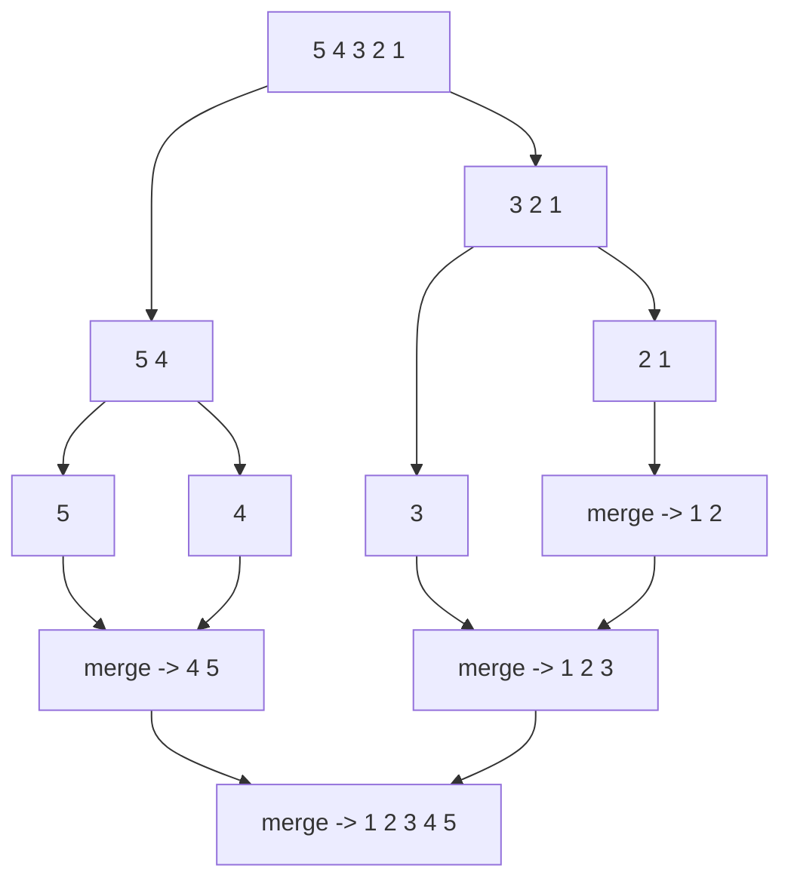

# 16 · Recursion III — Merge Sort, Quick Sort & Backtracking

> 📁 Part 16 of 28 in [Ytube dsa/](README.md) · **Prev:** [15 — Recursion II](15-Recursion_Subsets_Notes.md) · **Next:** [17 — Math & Bitwise](17-Math_and_Bitwise_Notes.md)

## Introduction
Two payoffs from recursion, and they are the two that matter most.

**Divide and conquer** breaks a problem into halves, solves each recursively, and combines — turning O(n²) sorting into **O(n log n)**.

**Backtracking** explores choices, and when one leads nowhere, *undoes it* and tries the next — which is how N-Queens and Sudoku are solved.

---

# Part A — Divide and Conquer

## 1. Merge Sort

Split in half, sort each half recursively, then merge two sorted arrays into one.

```java
static int[] mergeSort(int[] arr) {
    if (arr.length == 1) {
        return arr;                                     // base: one element is sorted
    }
    int mid = arr.length / 2;
    int[] left  = mergeSort(Arrays.copyOfRange(arr, 0, mid));
    int[] right = mergeSort(Arrays.copyOfRange(arr, mid, arr.length));
    return merge(left, right);
}

private static int[] merge(int[] first, int[] second) {
    int[] mix = new int[first.length + second.length];
    int i = 0, j = 0, k = 0;

    while (i < first.length && j < second.length) {     // take the smaller head
        if (first[i] < second[j]) mix[k++] = first[i++];
        else                      mix[k++] = second[j++];
    }
    while (i < first.length)  mix[k++] = first[i++];    // drain the leftovers
    while (j < second.length) mix[k++] = second[j++];
    return mix;
}
```
**Output** — `{5, 4, 3, 2, 1}`
```
[1, 2, 3, 4, 5]
```

**The recurrence** (note 13 §7): `T(n) = 2T(n/2) + O(n)` → **O(n log n)**. Two halves, each 1/2 the size, plus a linear merge. Master's theorem gives the middle case directly.



| | |
|---|---|
| Time | **O(n log n)** — best, average *and* worst |
| Space | **O(n)** — the merge buffer |
| Stable | ✅ — because `<` (not `<=`) takes from the left half first on ties |
| Adaptive | ❌ — same work on sorted input |

> 💡 **Why `first[i] < second[j]` and not `<=` matters:** on a tie it takes from the **left** array, preserving the original relative order of equal elements. That one character is what makes merge sort stable — and stability is why Java uses TimSort (a merge-sort variant) for objects (note 10 §5).

**The in-place variant** sorts within the original array using `start`/`end` indices rather than `copyOfRange`, avoiding the per-level allocations. Same O(n log n), still O(n) for the temporary merge buffer, but far less garbage.

## 2. Quick Sort

Pick a **pivot**, partition so smaller elements go left and larger go right, then recurse on both sides. No merge step — the partition does the work.

```java
static void quickSort(int[] nums, int low, int hi) {
    if (low >= hi) return;                       // base: 0 or 1 element

    int s = low, e = hi;
    int m = s + (e - s) / 2;
    int pivot = nums[m];                         // middle element as pivot

    while (s <= e) {
        while (nums[s] < pivot) s++;             // find a left item that's too big
        while (nums[e] > pivot) e--;             // find a right item that's too small
        if (s <= e) {                            // swap them
            int temp = nums[s];
            nums[s] = nums[e];
            nums[e] = temp;
            s++; e--;
        }
    }
    quickSort(nums, low, e);                     // sort both partitions
    quickSort(nums, s, hi);
}
```

| | |
|---|---|
| Time | **O(n log n)** average · **O(n²)** worst (badly chosen pivots) |
| Space | **O(log n)** average — just the call stack, no merge buffer |
| Stable | ❌ — long-distance swaps reorder equal elements |
| In place | ✅ |

**Merge sort vs quick sort** — the classic comparison:

| | Merge sort | Quick sort |
|---|---|---|
| Worst case | **O(n log n)** guaranteed | O(n²) |
| Extra space | O(n) | **O(log n)** |
| Stable | ✅ | ❌ |
| In practice | predictable | usually **faster** (cache-friendly, no allocation) |
| Java uses it for | **objects** (TimSort) | **primitives** (dual-pivot) |

That last row is the real answer to "which is better": Java ships **both**, and picks by whether stability is observable. For `int[]`, two equal ints are indistinguishable, so stability is meaningless and quicksort's speed wins. For objects, stability is guaranteed by the spec, so merge sort it is.

> 💡 **Why the O(n²) worst case happens:** if the pivot is always the smallest or largest element, one partition is empty and the other has n−1 — the recursion becomes linear depth, like a bad binary tree. Picking the *middle* element (as above) or a random one avoids the classic trigger of already-sorted input.

---

# Part B — Backtracking

## 3. The Idea

**Backtracking = recursion + undo.** Make a choice, recurse; if it fails, *take the choice back* and try the next one. It is exhaustive search made efficient by **pruning** invalid branches early.

The template:

```
for each choice:
    if the choice is valid:
        make it            (mark the board)
        recurse            (solve the rest)
        undo it            (unmark the board)  <-- the "backtrack"
```

That third line is the whole difference from note 15's generation problems. There, each branch built a *new* string, so nothing needed undoing. Here the board is **shared and mutated**, so it must be restored before trying the next option — otherwise later branches see a corrupted board.

## 4. Maze Paths

Count or print all paths from the top-left to the bottom-right, moving only down and right:

```java
static void printPath(String p, int r, int c) {
    if (r == 1 && c == 1) {
        System.out.println(p);
        return;
    }
    if (r > 1) printPath(p + 'D', r - 1, c);
    if (c > 1) printPath(p + 'R', r, c - 1);
}
```
**Output** (2×2 grid)
```
DDRR
RRDD
```

The `if (r > 1)` / `if (c > 1)` guards are pruning — don't step off the board. For an m×n grid the number of paths is **C(m+n-2, m-1)**, exponential in the grid size.

With an obstacle array you add a validity check; with a "visited" array and four directions (up/down/left/right) you get the **full backtracking form**, where marking and unmarking is essential:

```java
maze[r][c] = false;              // mark as visited
// ... recurse in all four directions ...
maze[r][c] = true;               // UNDO — restore for other paths
```

Without that restore, the first path explored would permanently block every later one.

## 5. N-Queens

Place N queens on an N×N board so none attack each other.

```java
static int queens(boolean[][] board, int row) {
    if (row == board.length) {
        display(board);
        return 1;                                    // one complete solution
    }
    int count = 0;
    for (int col = 0; col < board.length; col++) {
        if (isSafe(board, row, col)) {
            board[row][col] = true;                  // PLACE
            count += queens(board, row + 1);         // RECURSE
            board[row][col] = false;                 // REMOVE — backtrack
        }
    }
    return count;
}
```
**Output** — 4×4 board
```
X Q X X 
X X X Q 
Q X X X 
X X Q X 

X X Q X 
Q X X X 
X X X Q 
X Q X X 

2
```

**Exactly 2 solutions for N = 4** — the known correct answer. ✓

Two design choices carry the whole algorithm:

- **One queen per row, by construction.** The recursion advances by row, so row conflicts are impossible and never need checking. This collapses the search space enormously versus trying all C(16,4) placements.
- **`isSafe` only looks *upward*** — the current column above, and both diagonals above. Rows below are empty, so there is nothing to check.

The `board[row][col] = false` line is the backtrack. Delete it and the board fills with stale queens and you get no solutions at all.

## 6. Sudoku Solver

The same template on a harder board:

```java
static boolean solve(int[][] board) {
    int row = -1, col = -1;
    boolean emptyLeft = true;

    for (int i = 0; i < board.length && emptyLeft; i++) {      // find an empty cell
        for (int j = 0; j < board.length; j++) {
            if (board[i][j] == 0) { row = i; col = j; emptyLeft = false; break; }
        }
    }
    if (emptyLeft) return true;                                // no empties -> solved

    for (int number = 1; number <= 9; number++) {
        if (isSafe(board, row, col, number)) {
            board[row][col] = number;                          // PLACE
            if (solve(board)) return true;                     // RECURSE
            board[row][col] = 0;                               // UNDO
        }
    }
    return false;                                              // no digit works
}
```

Note the return type is **`boolean`**, not `int` — Sudoku wants *one* solution, so the first success propagates `true` straight up and stops everything. N-Queens returns a count because it wants *all* solutions. **The return type encodes the goal.**

`isSafe` checks three constraints: the row, the column, and the 3×3 box. The box index trick is worth remembering:
```java
int sqrtN = (int)(Math.sqrt(board.length));     // 3
int boxRowStart = row - row % sqrtN;            // snap to the box's top-left
int boxColStart = col - col % sqrtN;
```

## 7. Complexity

| Problem | Time | Space |
|---|---|---|
| Merge sort | **O(n log n)** all cases | O(n) |
| Quick sort | O(n log n) avg, O(n²) worst | O(log n) |
| Maze paths (m×n) | O(2^(m+n)) | O(m+n) stack |
| N-Queens | O(N!) upper bound | O(N²) board + O(N) stack |
| Sudoku | O(9^(empty cells)) worst | O(1) board, O(cells) stack |

Backtracking's stated bounds are almost always **wild overestimates** — pruning cuts the real search enormously. Sudoku's 9⁸¹ theoretical worst case solves in milliseconds in practice, because `isSafe` kills most branches immediately.

> 💡 **That is the lesson:** backtracking's efficiency comes from *how early you can detect failure*. A stronger constraint check explores fewer branches. This is also why N-Queens fixes one queen per row — it prunes an entire dimension of the search space before the search even begins.

---

## ⚠️ Common Misunderstandings
**1. Merge sort and quick sort are interchangeable.**
❌ interchangeable · ✅ merge is stable with a guaranteed O(n log n) but costs O(n) space; quick is in-place and usually faster but O(n²) worst and unstable. Java ships both, chosen by element type.

**2. `first[i] <= second[j]` in the merge is equivalent.**
❌ equivalent · ✅ `<` takes from the left on ties, which is exactly what makes merge sort **stable**.

**3. Quicksort's worst case is rare and unimportant.**
❌ ignorable · ✅ it's triggered by *sorted* input with a naive first-element pivot — a very common real case. Middle or random pivots avoid it.

**4. Backtracking is just recursion.**
❌ just recursion · ✅ recursion **plus undo**. The board is shared and mutated, so each choice must be reversed before trying the next.

**5. You can skip the undo if you return early.**
❌ skip it · ✅ only safe on the success path (Sudoku returns `true` immediately). On failure the undo is mandatory, or later branches see a corrupted board.

**6. N-Queens needs to check for row conflicts.**
❌ needs to · ✅ placing one queen per row by construction makes them impossible. `isSafe` only looks upward.

**7. N-Queens has many solutions for N=4.**
❌ many · ✅ exactly **2**, verified. (N=2 and N=3 have none at all.)

**8. Backtracking's O(N!) bound reflects real runtime.**
❌ reflects it · ✅ it's an upper bound assuming no pruning. Real performance depends on how early invalid branches are detected.

## JavaScript Comparison
| | Java | JavaScript |
|---|---|---|
| Copy a subarray | `Arrays.copyOfRange(a, i, j)` | `a.slice(i, j)` |
| Built-in sort | `Arrays.sort` — dual-pivot / TimSort | `arr.sort()` — usually TimSort |
| 2-D board | `boolean[][]` | array of arrays |
| Stack depth for recursion | ~19,700 | ~10,000 |

> 💡 Both ship an O(n log n) sort, so you'd never hand-write these outside an interview. The reason to know them is the *recurrence* (merge sort is the canonical O(n log n) derivation) and the *partition* idea, which reappears in quickselect for "kth largest".

## Interview Angles
- **"Implement merge sort."** — Write it, then derive `T(n) = 2T(n/2) + O(n)` → O(n log n) unprompted. Mention O(n) space and stability.
- **"Merge sort vs quick sort?"** — Stability, space, worst case, and the fact that Java uses each for a different element type. A complete answer here is a strong signal.
- **"When is quicksort O(n²)?"** — Consistently extreme pivots; sorted input with a first-element pivot. Fix: middle/random pivot.
- **"N-Queens."** (LeetCode 51) — Place/recurse/undo, one queen per row, check upward only. Say "backtracking" and name the undo step.
- **"Sudoku solver."** (37) — Same template, `boolean` return to stop at the first solution.
- **"What makes backtracking efficient?"** — Pruning. The earlier you detect an invalid partial solution, the smaller the real search.
- **"Kth largest element."** — Quickselect: quicksort's partition, but recurse into only one side. O(n) average.

## Related · Next
- **Related:** [[Recursion II]] (15) · [[Sorting]] (10 — the O(n²) sorts these replace) · [[Complexity Analysis]] (13 — the recurrences) · [[Backtracking]] (5.1)
- **Practice:** implement merge sort and derive its recurrence from scratch. Then N-Queens (51) and Sudoku Solver (37) — write the place/recurse/undo skeleton *before* writing `isSafe`.
- **Next:** [17 — Math & Bitwise](17-Math_and_Bitwise_Notes.md)

---

## 🔁 Rapid Revision (self-test)
<details><summary>1. Merge sort's recurrence and complexity?</summary>

`T(n) = 2T(n/2) + O(n)` → **O(n log n)** in all cases, O(n) space for the merge buffer.
</details>

<details><summary>2. What single character makes merge sort stable?</summary>

The `<` in `first[i] < second[j]`. On a tie it takes from the left half, preserving original order. `<=` would break stability.
</details>

<details><summary>3. When is quicksort O(n²), and how do you avoid it?</summary>

When pivots are consistently extreme — classically sorted input with a first-element pivot. Use a middle or random pivot.
</details>

<details><summary>4. Why does Java use quicksort for primitives and merge sort for objects?</summary>

Stability is unobservable for equal primitives, so quicksort's speed and O(log n) space win. For objects stability is spec-guaranteed, so TimSort (merge-based) is used.
</details>

<details><summary>5. What distinguishes backtracking from plain recursion?</summary>

The **undo**. The board is shared and mutated, so after recursing you must restore it before trying the next choice.
</details>

<details><summary>6. Two design choices that make N-Queens tractable?</summary>

One queen per row by construction (row conflicts become impossible), and `isSafe` checking only upward, since rows below are still empty.
</details>

<details><summary>7. How many solutions does 4-Queens have?</summary>

Exactly **2** — verified by running it.
</details>

<details><summary>8. Why does the Sudoku solver return `boolean` while N-Queens returns `int`?</summary>

Sudoku wants one solution, so `true` propagates up and stops the search. N-Queens wants all solutions, so it accumulates a count. The return type encodes the goal.
</details>

<details><summary>9. What actually determines backtracking's real-world speed?</summary>

How early invalid branches are pruned. The stated O(N!) / O(9^cells) bounds assume no pruning; strong constraint checks make the real search vastly smaller.
</details>
